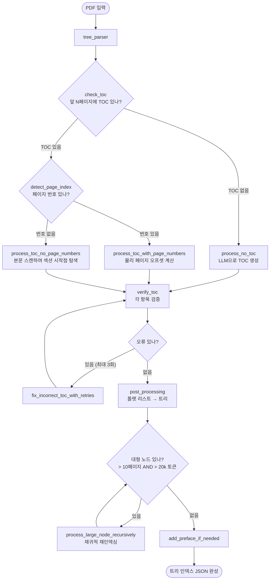
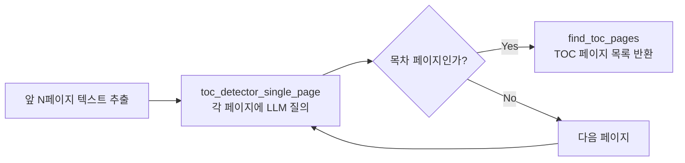
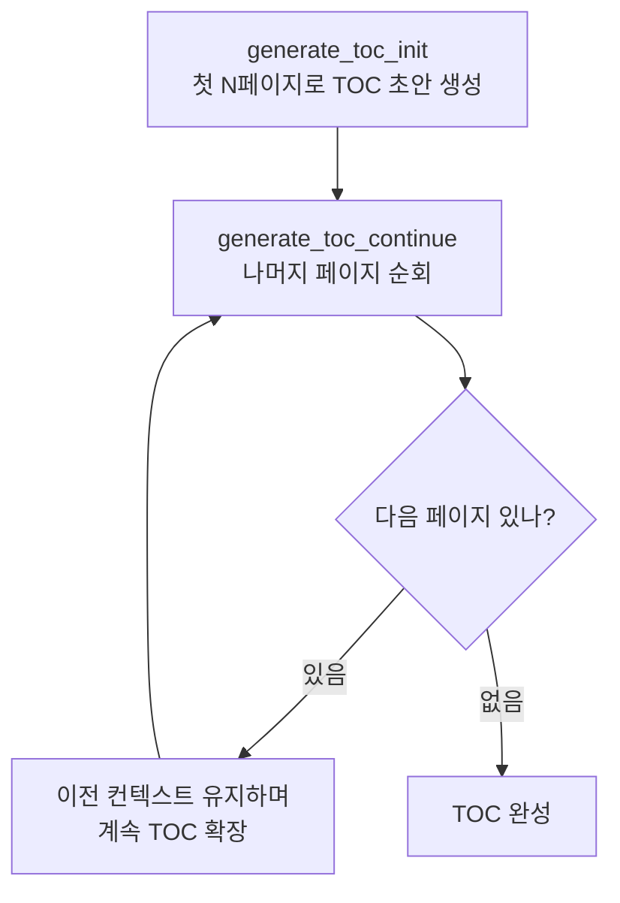
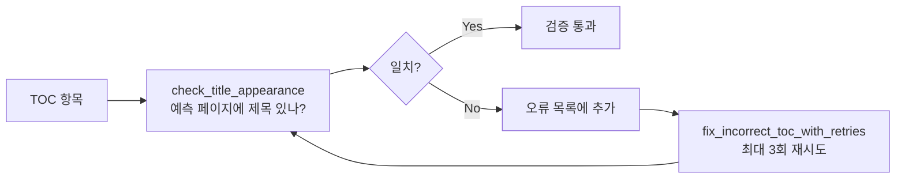
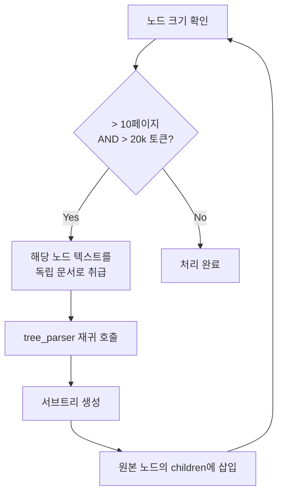
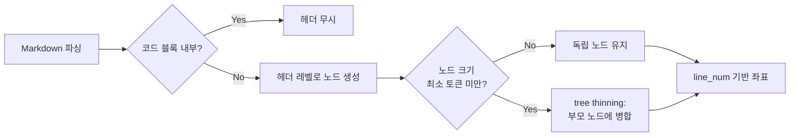

# PageIndex 핵심 알고리즘

> `pageindex/page_index.py` (49KB) — PDF를 계층 트리 인덱스로 변환하는 핵심 엔진

---

## 전체 파이프라인



---

## 단계별 상세 설명

### 1단계: TOC 탐지 (`check_toc`)



- `toc_check_page_num` (기본 20): 탐지 범위
- 각 페이지를 LLM에게 "이 페이지가 목차인가?" 질의
- 병렬 처리로 속도 최적화

### 2단계: 페이지 오프셋 계산 (`calculate_page_offset`)

PDF의 **인쇄된 페이지 번호**와 **물리적 페이지 인덱스**는 다르다.

```
예시:
  표지 (물리 0) → 인쇄 번호 없음
  목차 (물리 1-3) → 인쇄 번호 없음
  본문 시작 (물리 4) → 인쇄 번호 "1"

  오프셋 = 물리 인덱스 - 인쇄 번호 = 4 - 1 = 3
```

**다수결 투표**로 오프셋을 결정한다:
1. TOC 항목 여러 개를 샘플링
2. 각 항목에 대해 `(물리 페이지) - (인쇄 번호)` 계산
3. 가장 많이 나온 값을 오프셋으로 채택

### 3단계: TOC 없는 문서 처리 (`process_no_toc`)



- 슬라이딩 윈도우 방식으로 문서 순회
- 이전 TOC 구조를 컨텍스트로 유지하여 일관성 확보

### 4단계: TOC 검증 (`verify_toc`)



- `check_title_appearance_in_start_concurrent`: 섹션이 페이지 **시작 부분**에 있는지 확인 (페이지 중간에 시작하는 경우 처리)

### 5단계: 대형 노드 재귀 처리 (`process_large_node_recursively`)



이로써 수백 페이지 문서도 계층적으로 세분화된다.

### 6단계: 후처리 (`post_processing`)

플랫(flat) 리스트를 계층 트리로 변환:

```
입력: [{title: "1장", level: 1, page: 4}, {title: "1.1", level: 2, page: 5}, ...]
출력: {title: "1장", start: 4, end: ..., nodes: [{title: "1.1", ...}]}
```

---

## 핵심 함수 맵

| 함수 | 역할 |
|------|------|
| `tree_parser()` | 최상위 비동기 오케스트레이터 |
| `check_toc()` | TOC 존재 여부 탐지 |
| `find_toc_pages()` | TOC 페이지 번호 목록 반환 |
| `toc_detector_single_page()` | 단일 페이지 TOC 여부 LLM 판정 |
| `toc_extractor()` | 원시 TOC 텍스트 → 구조화 |
| `toc_transformer()` | TOC JSON 정규화 |
| `detect_page_index()` | TOC에 페이지 번호 포함 여부 확인 |
| `calculate_page_offset()` | 다수결로 물리 오프셋 계산 |
| `process_toc_with_page_numbers()` | TOC + 번호 있는 경우 처리 |
| `process_toc_no_page_numbers()` | TOC 있으나 번호 없는 경우 처리 |
| `process_no_toc()` | TOC 없는 경우: LLM으로 생성 |
| `generate_toc_init()` | 첫 부분으로 TOC 초안 생성 |
| `generate_toc_continue()` | 나머지 부분으로 TOC 확장 |
| `verify_toc()` | TOC 항목 전체 검증 |
| `check_title_appearance()` | 예측 페이지에 제목 실존 확인 |
| `fix_incorrect_toc_with_retries()` | 오류 수정 (최대 3회) |
| `process_large_node_recursively()` | 대형 노드 재귀 세분화 |
| `post_processing()` | 플랫 리스트 → 트리 변환 |
| `add_preface_if_needed()` | 도입부 노드 추가 |
| `page_list_to_group_text()` | 페이지 묶음을 LLM 처리용 텍스트로 변환 |

---

## Markdown 처리 (`page_index_md.py`)

PDF와 달리 Markdown은 헤더(`#`, `##`, `###`)가 명시적 구조를 제공한다.



- 페이지 번호 대신 `line_num`을 좌표로 사용
- 너무 작은 노드는 병합 (tree thinning)
- `md_to_tree()` 비동기 함수
