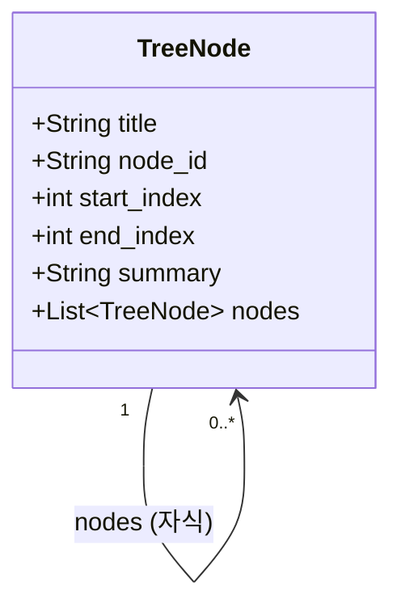
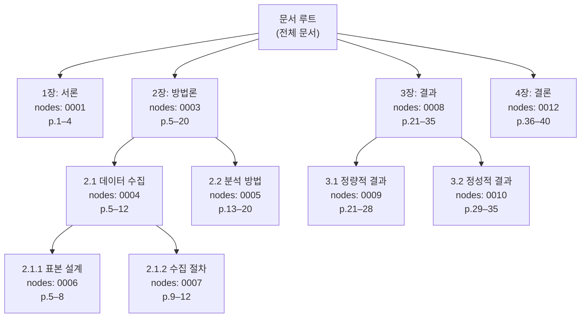
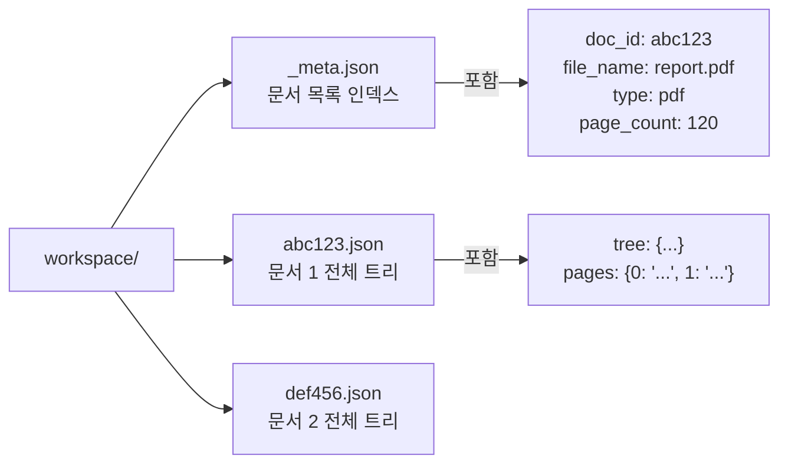

# PageIndex 데이터 구조

> 트리 인덱스의 핵심 JSON 스키마와 내부 구조 설명

---

## 트리 노드 JSON 스키마



### 필드 설명

| 필드 | 타입 | 설명 |
|------|------|------|
| `title` | string | 섹션 제목 (TOC에서 추출) |
| `node_id` | string | 4자리 순번 ("0001", "0002", ...) |
| `start_index` | int | 시작 페이지 물리 인덱스 (0-based) |
| `end_index` | int | 끝 페이지 물리 인덱스 (exclusive) |
| `summary` | string | LLM이 생성한 섹션 요약 |
| `nodes` | array | 자식 노드 목록 (없으면 빈 배열) |

### 실제 예시

```json
{
  "title": "2장: 방법론",
  "node_id": "0003",
  "start_index": 21,
  "end_index": 35,
  "summary": "데이터 수집 및 분석 방법론을 설명한다...",
  "nodes": [
    {
      "title": "2.1 데이터 수집",
      "node_id": "0004",
      "start_index": 21,
      "end_index": 28,
      "summary": "설문 조사를 통해 1,000명의 데이터를...",
      "nodes": []
    },
    {
      "title": "2.2 분석 방법",
      "node_id": "0005",
      "start_index": 28,
      "end_index": 35,
      "summary": "회귀 분석과 클러스터링을 적용하여...",
      "nodes": []
    }
  ]
}
```

---

## 전체 트리 구조



---

## 워크스페이스 파일 구조

PageIndexClient는 처리 결과를 로컬 파일 시스템에 캐싱한다.



### `_meta.json` 예시

```json
{
  "abc123": {
    "doc_id": "abc123",
    "file_name": "annual_report.pdf",
    "file_path": "/path/to/file.pdf",
    "type": "pdf",
    "page_count": 120,
    "doc_description": "VectifyAI 2023 연간보고서",
    "created_at": "2024-01-15T10:30:00"
  }
}
```

### 개별 문서 JSON 구조

```json
{
  "meta": { ... },
  "tree": {
    "title": "...",
    "nodes": [...]
  },
  "pages": {
    "0": "첫 번째 페이지 텍스트...",
    "1": "두 번째 페이지 텍스트...",
    ...
  }
}
```

> **Lazy Loading**: `get_document_structure()` 호출 시 `tree`만 로드.  
> `get_page_content()` 호출 시 해당 페이지의 `pages` 엔트리만 로드.  
> 불필요한 메모리 사용을 방지한다.

---

## 페이지 범위 표현 형식

`get_page_content()` 함수가 받는 pages 파라미터 형식:

| 입력 | 의미 |
|------|------|
| `"5-7"` | 5페이지, 6페이지, 7페이지 |
| `"3,8"` | 3페이지, 8페이지 |
| `"12"` | 12페이지만 |
| `"1-3,7,10-12"` | 1~3, 7, 10~12 |

---

## start_index / end_index 의미

```
물리 페이지:  0    1    2    3    4    5    6    7    8
              [표지][목차1][목차2][본문1][본문2][본문3][본문4][본문5][부록]

예시 노드:
  title: "2장"
  start_index: 4   → 물리 4번 페이지부터 (= 인쇄 번호 "2")
  end_index: 7     → 물리 7번 페이지 직전까지 (= 4,5,6번 포함)
```

`end_index`는 **exclusive** (Python slice 관례와 동일).
