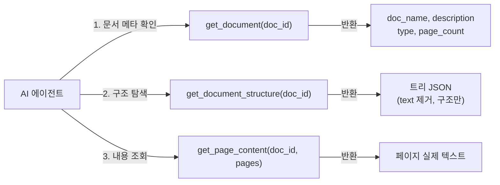
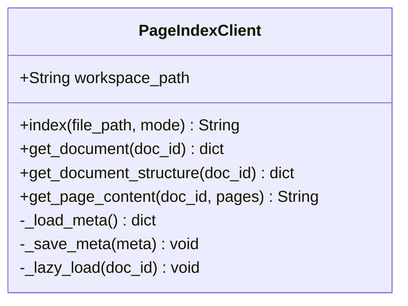
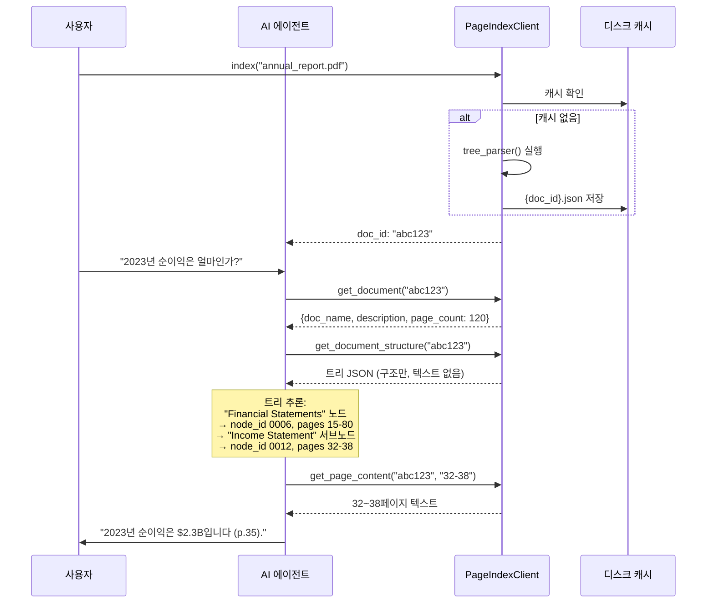
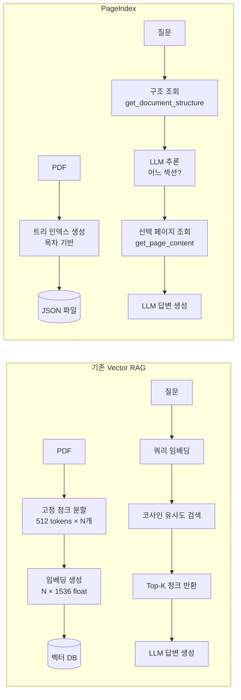

# PageIndex 에이전트 인터페이스

> `pageindex/retrieve.py` + `pageindex/client.py` — 에이전트가 문서를 탐색하는 방법

---

## 세 가지 도구 함수

에이전트에게 노출되는 인터페이스는 세 함수로 구성된다.



### `get_document(doc_id)`

```python
# 반환 예시
{
    "doc_name": "annual_report_2023.pdf",
    "doc_description": "VectifyAI 2023 연간보고서. 재무 현황, 사업 성과, 리스크 요소 포함.",
    "type": "pdf",
    "page_count": 120
}
```

### `get_document_structure(doc_id)`

```python
# 반환 예시 (text 필드 제거됨 — 토큰 절약)
{
    "title": "VectifyAI 2023 Annual Report",
    "nodes": [
        {"title": "1. Business Overview", "node_id": "0001", "start_index": 4, "end_index": 15, "nodes": [...]},
        {"title": "2. Financial Statements", "node_id": "0006", "start_index": 15, "end_index": 80, "nodes": [...]},
        ...
    ]
}
```

### `get_page_content(doc_id, pages)`

```python
# 호출 예시
get_page_content("abc123", "15-18")

# 반환: 15~18페이지 실제 텍스트 연결
```

---

## PageIndexClient API



| 메서드 | 입력 | 반환 | 비고 |
|--------|------|------|------|
| `index()` | 파일 경로, mode | doc_id (string) | 이미 처리된 경우 캐시 반환 |
| `get_document()` | doc_id | 메타데이터 dict | |
| `get_document_structure()` | doc_id | 트리 JSON | text 필드 제거됨 |
| `get_page_content()` | doc_id, pages | 텍스트 string | "5-7", "3,8", "12" 형식 |

`mode` 파라미터:
- `"auto"`: 확장자 기반 자동 선택
- `"pdf"`: PDF 강제 처리
- `"md"`: Markdown 강제 처리

---

## Agentic RAG 데모 흐름

`examples/agentic_vectorless_rag_demo.py` — OpenAI Agents SDK 사용



---

## 에이전트 시스템 프롬프트 전략

데모에서 사용되는 에이전트 지침의 핵심:

```
1. 먼저 get_document_structure()로 전체 목차를 확인하라
2. 답변에 필요한 섹션을 추론하라
3. 가능한 좁은 페이지 범위를 요청하라 (전체 문서를 읽지 말 것)
4. 답변에 참조 페이지를 명시하라
```

이는 사람이 도서관에서 책을 찾는 방식과 동일하다:
1. 서지 목록에서 책 확인
2. 목차에서 해당 장/절 확인
3. 해당 페이지만 펼쳐 읽기
4. 출처 명시

---

## 기존 Vector RAG vs PageIndex 비교



| 비교 항목 | Vector RAG | PageIndex |
|-----------|-----------|-----------|
| 인덱싱 비용 | 임베딩 API 비용 | LLM API 비용 (더 높음) |
| 쿼리 비용 | 낮음 (벡터 연산) | 중간 (LLM 추론) |
| 문맥 보존 | 낮음 (청크 단위 단절) | 높음 (섹션 단위) |
| 설명 가능성 | 낮음 | 높음 (경로 추적) |
| 구조 없는 문서 | 가능 | 어려움 |
| 대용량 문서 | 가능 | 최적 (트리로 세분화) |

---

## 제약 사항

- **PDF 텍스트 추출 품질 의존**: PyPDF2/pymupdf 기반. 스캔 이미지 PDF는 OCR 필요 (별도 유료 서비스)
- **인덱싱 시 LLM 비용**: 문서당 gpt-4o 호출 다수 → 업프론트 비용 발생
- **오픈소스 범위**: 인덱싱 엔진만 포함. MCTS 검색, 멀티-문서, 채팅 UI, 클라우드 API는 별도 제품
- **"청킹 없음"의 진짜 의미**: 검색 단위가 고정 청크가 아닌 것. 내부 LLM 처리를 위해 `page_list_to_group_text()`에서 텍스트 분할은 여전히 수행
