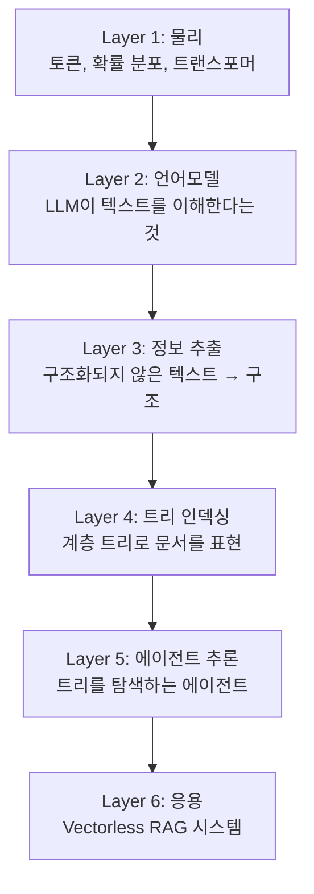
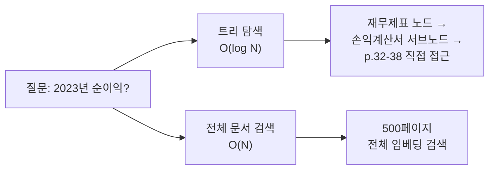
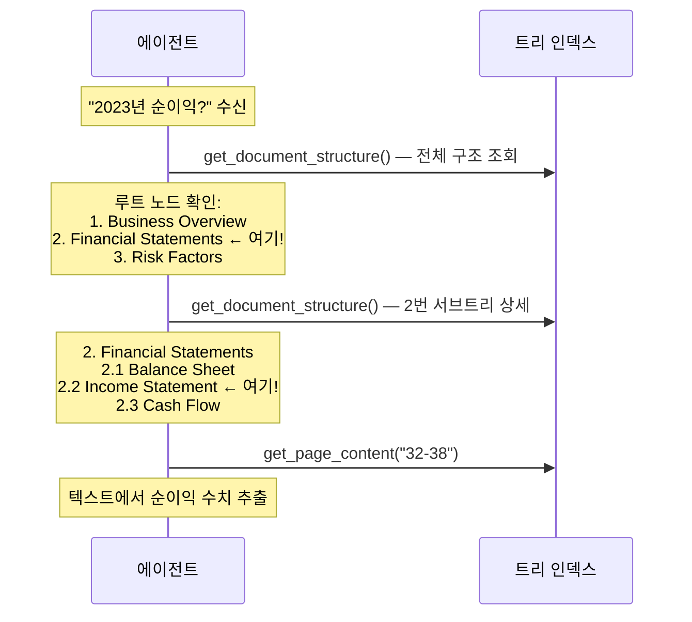
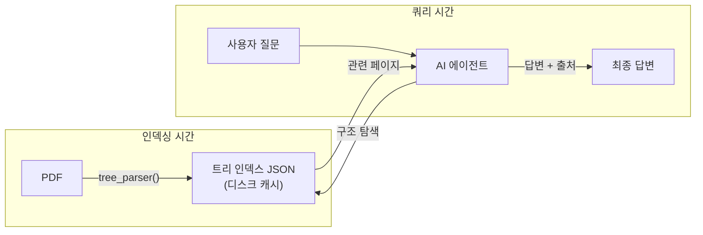

# PageIndex 제1원리 해설

> Richard Feynman 방식으로, 물리 계층부터 응용까지 6계층으로 분해한다.  
> "왜 이렇게 작동하는가?"를 각 계층의 인과관계로 설명한다.

---

## 계층 맵



---

## Layer 1: 물리 계층 — 토큰과 확률

### 실패 시나리오

"500페이지 PDF를 통째로 GPT에게 넣는다" → 컨텍스트 한도 초과 or 비용 폭발.

### 원리

LLM은 토큰 시퀀스를 받아 다음 토큰의 확률 분포를 출력한다. 이 과정에서:

1. **컨텍스트 한도**: Transformer는 O(N²) 어텐션 연산 → 길이가 2배면 비용 4배
2. **토큰 경제학**: gpt-4o는 토큰당 과금 → 불필요한 텍스트 = 직접적인 비용
3. **신호 대 잡음비**: 관련 없는 텍스트가 많을수록 LLM의 집중도 저하

```
물리적 제약:
  GPU 메모리 ∝ 시퀀스 길이²
  비용 ∝ 입력 토큰 수
  품질 ∝ 1 / (노이즈 비율)
```

**PageIndex의 해법**: 전체 문서가 아닌 **필요한 페이지만** LLM에게 전달.

---

## Layer 2: 언어모델 계층 — LLM의 이해 능력

### 실패 시나리오

"목차가 있는가?" 라는 질문을 규칙 기반으로 풀려 한다 → 형식이 다양해서 실패.

### 원리

LLM은 **자연어 패턴 인식**에 강하다. 이것을 전략적으로 활용한다:

| LLM에게 시키는 것 | 전통적 방법과의 차이 |
|-----------------|-------------------|
| "이 페이지가 목차인가?" | 정규식으로 탐지 불가 (형식 다양) |
| "이 텍스트에서 목차를 JSON으로" | 파싱 규칙 작성 불가 |
| "이 항목이 몇 페이지에 시작하나?" | 레이아웃 분석 필요 |
| "이 섹션의 내용을 요약하라" | 전통 NLP 접근 어려움 |

**인과 관계**: LLM이 범용 텍스트 이해 능력을 가지므로, 문서 구조 파악을 LLM에 위임하면 범용성이 확보된다.

---

## Layer 3: 정보 추출 계층 — 비구조 → 구조

### 실패 시나리오

LLM에게 "목차 추출해줘" → 자유 형식 텍스트로 반환 → 파싱 불가.

### 원리

PageIndex의 LLM 호출은 항상 **JSON 출력을 강제**한다.

```
입력: "제1장 서론 ........ 3\n제2장 방법론 ...... 7\n..."

LLM 프롬프트: "위 텍스트에서 목차를 다음 JSON 형식으로 추출하라:
[{"title": "...", "page": N}, ...]"

출력: [{"title": "제1장 서론", "page": 3}, {"title": "제2장 방법론", "page": 7}]
```

**오류 복구**: `fix_incorrect_toc_with_retries()`가 최대 3회 재시도하는 이유 — LLM 출력은 확률적이므로 한 번의 실패가 치명적이면 안 된다.

---

## Layer 4: 트리 인덱싱 계층 — 계층 구조의 힘

### 실패 시나리오

"섹션 2.1은 몇 페이지?" → 플랫 목록에서는 선형 탐색 필요.

### 원리

계층 트리가 유리한 이유:



1. **계층성**: 큰 섹션 → 하위 섹션으로 범위를 좁힘
2. **포인터 역할**: 각 노드가 `start_index`, `end_index`로 실제 텍스트를 가리킴
3. **요약 포함**: `summary` 필드로 에이전트가 내용을 읽지 않고도 관련성 판단 가능

**대형 노드 재귀 처리의 이유**: 한 섹션이 너무 크면(>10페이지, >20k 토큰) LLM이 그 섹션을 내부적으로 처리할 때도 동일한 문제에 직면한다. 따라서 재귀적으로 세분화.

---

## Layer 5: 에이전트 추론 계층 — 탐색 전략

### 실패 시나리오

에이전트에게 전체 트리를 매번 넘겨준다 → 대형 문서에서 트리 자체가 수천 토큰.

### 원리

에이전트가 **인간 독서 전략을 모방**한다:



**핵심 통찰**: 에이전트는 전체 텍스트를 읽지 않는다. **어디를 읽을지 먼저 결정하고, 그곳만 읽는다.** 이것이 "Reasoning-based" RAG의 의미다.

---

## Layer 6: 응용 계층 — 실제 시스템

### 전체 흐름 요약



### 비용-품질 트레이드오프

```
인덱싱 비용 높음 (LLM × 多) → 쿼리 비용 낮음 (필요 페이지만)
임베딩 비용 낮음             → 쿼리 비용 중간 (벡터 연산 + LLM)

PageIndex: 업프론트 투자 → 쿼리 효율화
Vector RAG: 빠른 인덱싱 → 쿼리마다 잠재적 품질 손실
```

### "No Chunking"의 정확한 의미

| 주장 | 사실 |
|------|------|
| 청킹을 전혀 하지 않는다 | **틀림** — 내부 처리용으로 `page_list_to_group_text()`에서 분할함 |
| **검색 단위**가 고정 청크가 아니다 | **맞음** — 검색 단위는 문서 구조 기반 섹션 |
| 임베딩 벡터를 사용하지 않는다 | **맞음** — 벡터 DB 없음, JSON 트리만 사용 |

---

## 핵심 인과 연쇄 (한 문장 요약)

```
PDF의 물리적 크기(수백 페이지) 문제를
LLM의 자연어 이해 능력으로 구조화하여(목차 트리 생성)
에이전트가 필요한 부분만 읽게 함으로써(추론 기반 탐색)
벡터 임베딩 없이도 정확한 답변을 가능하게 한다.
```

---

## 유추 대응 표

| PageIndex 개념 | 실세계 유추 |
|---------------|-----------|
| 트리 인덱스 | 도서관 카탈로그 (제목 + 위치) |
| `get_document_structure()` | 책의 목차 펼치기 |
| `get_page_content()` | 해당 장을 펼쳐 읽기 |
| `node_id` | 도서관 청구기호 |
| `start_index` / `end_index` | 책의 페이지 번호 |
| 에이전트 추론 | 사서가 요청 듣고 적절한 책/페이지 안내 |
| 재귀 노드 처리 | 두꺼운 장을 다시 소절로 나누기 |
| 페이지 오프셋 | 인쇄 쪽수와 실제 쪽수의 차이 |
