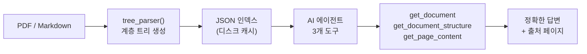

# PageIndex 분석

> https://github.com/VectifyAI/PageIndex  
> Vectorless, Reasoning-based RAG 엔진 분석 노트

---

## 파일 목록

| 파일 | 내용 |
|------|------|
| [01-overview.md](./01-overview.md) | 개요, 핵심 개념, 저장소 구조, 성능 |
| [02-algorithm.md](./02-algorithm.md) | PDF/MD 처리 파이프라인, 핵심 함수 맵 |
| [03-data-structures.md](./03-data-structures.md) | 트리 노드 JSON 스키마, 워크스페이스 구조 |
| [04-agent-interface.md](./04-agent-interface.md) | 에이전트 도구 API, RAG 흐름 비교 |
| [05-first-principles.md](./05-first-principles.md) | 제1원리 6계층 해설 (물리 → 응용) |

---

## 한 줄 요약

PDF의 물리적 크기 문제를 LLM의 자연어 이해 능력으로 구조화하여, 에이전트가 필요한 부분만 읽게 함으로써 벡터 임베딩 없이도 정확한 문서 QA를 가능하게 한다.

---

## 핵심 아키텍처

