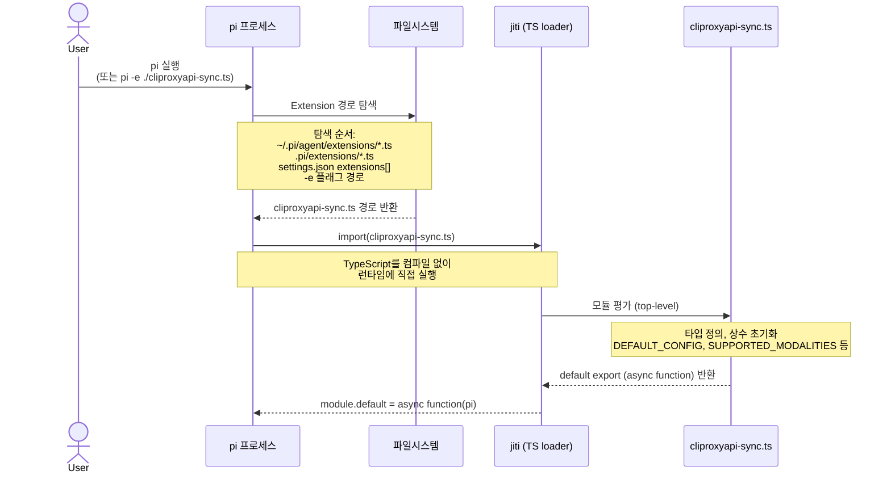
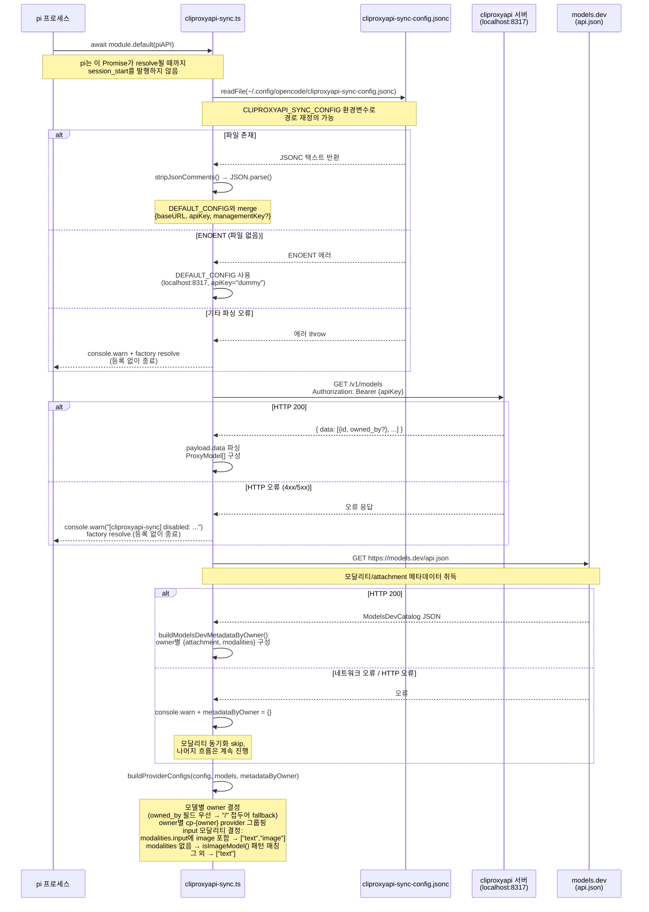
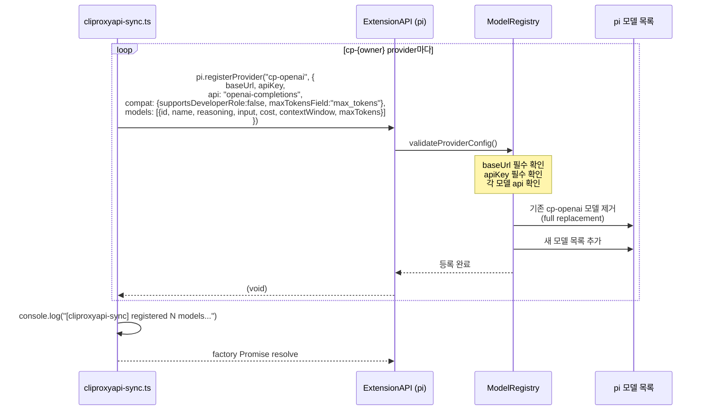
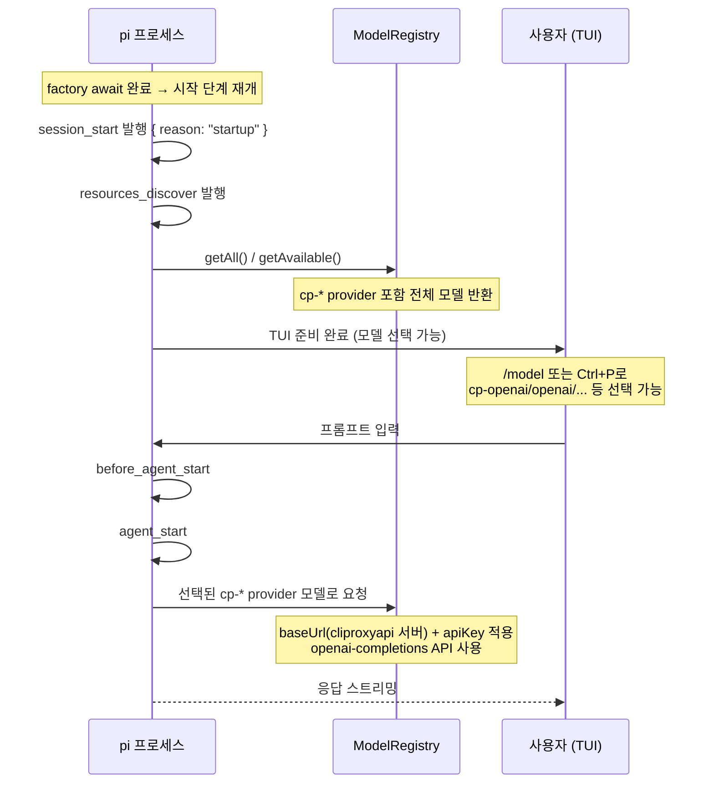
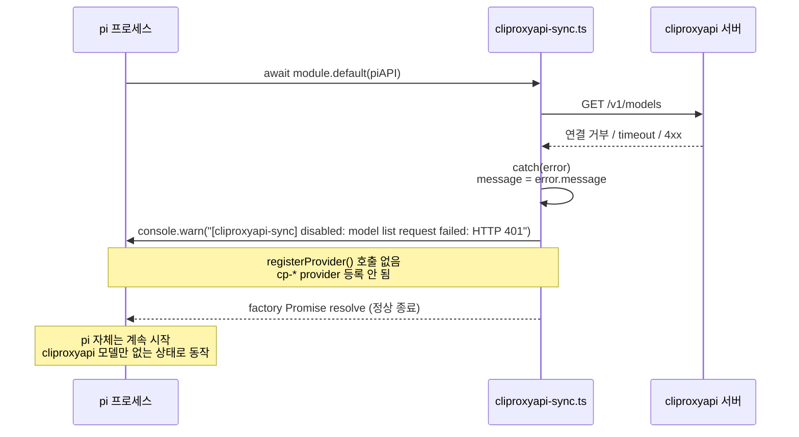

# cliproxyapi-sync Pi Extension — 로딩 및 동작 메커니즘

`pi/extensions/cliproxyapi-sync.ts`가 pi에 로드되고 동작하는 전체 흐름을 설명한다.

---

## 목차

- [전체 흐름 개요](#전체-흐름-개요)
- [1. pi 시작 — Extension 탐색 및 로드](#1-pi-시작--extension-탐색-및-로드)
- [2. async factory 실행 — 설정 로드 및 외부 API 호출](#2-async-factory-실행--설정-로드-및-외부-api-호출)
- [3. Provider 등록 — ModelRegistry 반영](#3-provider-등록--modelregistry-반영)
- [4. 정상 흐름 완료 후 — session_start 및 이후 라이프사이클](#4-정상-흐름-완료-후--session_start-및-이후-라이프사이클)
- [5. 오류 경로](#5-오류-경로)
- [주요 설계 포인트 요약](#주요-설계-포인트-요약)

---

## 전체 흐름 개요

```
pi 프로세스 시작
  └─► Extension 탐색 (auto-discovery / -e 플래그)
        └─► jiti로 cliproxyapi-sync.ts 로드
              └─► async default export 실행 (pi 가 await)
                    ├─► cliproxyapi-sync-config.jsonc 로드
                    ├─► cliproxyapi GET /v1/models
                    ├─► models.dev GET api.json
                    ├─► buildProviderConfigs()
                    └─► pi.registerProvider("cp-*", ...) × N
                          └─► ModelRegistry에 cp-* provider 등록 완료
  └─► session_start 발행
  └─► resources_discover 발행
  └─► (이후 일반 에이전트 루프)
```

---

## 1. pi 시작 — Extension 탐색 및 로드



---

## 2. async factory 실행 — 설정 로드 및 외부 API 호출

pi는 factory가 `async function`이면 **`await`하여 완료를 기다린 후** 다음 시작 단계로 진행한다.  
따라서 이 단계의 모든 처리가 끝나야 `session_start`가 발행된다.



---

## 3. Provider 등록 — ModelRegistry 반영



---

## 4. 정상 흐름 완료 후 — session_start 및 이후 라이프사이클



---

## 5. 오류 경로



---

## 주요 설계 포인트 요약

| 항목 | 내용 |
|------|------|
| **로더** | [jiti](https://github.com/unjs/jiti) — 컴파일 없이 TypeScript 직접 실행 |
| **factory 타입** | `async function` — pi가 `await`하여 완료 보장 |
| **block 지점** | factory resolve 전까지 `session_start` 발행 안 됨 |
| **설정 파일** | `~/.config/opencode/cliproxyapi-sync-config.jsonc` (JSONC, 주석 허용) |
| **설정 미존재 시** | DEFAULT_CONFIG(`localhost:8317`)로 fallback, 오류 없이 진행 |
| **models.dev 실패 시** | warning만 출력, 모달리티 없이 나머지 동기화 계속 진행 |
| **proxy 서버 실패 시** | `console.warn` 후 factory resolve — pi는 계속 시작 |
| **provider 명명** | `cp-{normalizedOwner}` (예: `cp-openai`, `cp-github-copilot`) |
| **모달리티 결정** | models.dev `modalities.input` 우선 → 없으면 `isImageModel()` 패턴 매칭 |
| **pi 스키마 제약** | pi `registerProvider` 모델은 `input: ("text" \| "image")[]`만 지원 — audio/video/pdf는 image 유무로만 반영 |
| **hot-reload** | `~/.pi/agent/extensions/`에 배치 시 `/reload` 커맨드로 재실행 가능 |
