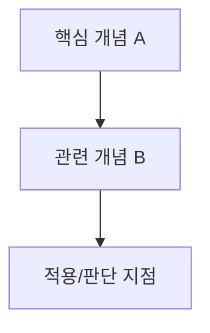

<!-- Args: $1 = <주제> (required, e.g. "영어 회화", "재무회계", "Redis 7") -->
# 학습 프로젝트 초기화

학습 주제: **${1:?(주제를 지정하세요)}**

현재 cwd(세션 기준 디렉토리) 아래에 새 학습 프로젝트를 세팅한다.
이 커맨드가 표준 구조와 원칙을 자체 정의한다.
외부 레퍼런스 프로젝트를 읽지 말고, 아래 스펙만 기준으로 주제에 맞는 실제 개념을 채운다.
개발/기술 주제는 가능한 예시 중 하나일 뿐이며, 언어·운동·음악·경영·글쓰기·자격증·학문 등 모든 학습 분야에 맞게 일반화한다.

## 1. 디렉토리
사용자 브리프 확인 후 `study-{slug}`를 생성한다. slug 규칙:
- 소문자, 띄어쓰기→하이픈, 버전 숫자는 유지
- 한글/비영어 주제는 의미가 유지되는 짧은 영문 slug로 변환
- "영어 회화" → `study-english-conversation`
- "재무회계" → `study-financial-accounting`
- "Redis 7" → `study-redis7`

## 2. 학습 설계 브리프 인터뷰

프로젝트 파일을 만들기 전에 먼저 **짧은 학습 설계 브리프**를 확정한다.
브리프는 별도 파일(`learning-brief.md` 등)로 만들지 않는다. 최종 README의 `커리큘럼 설계 근거` 섹션에 요약해 반영한다.

질문은 많이 쪼개지 말고, **해당 코딩 에이전트가 제공하는 구조화 질문 도구**를 우선 사용해 한 번에 묻는다.
- Pi에서는 `ask_user_question` tool을 사용한다.
- 다른 에이전트에서 이 프롬프트를 포팅해 사용할 경우, 해당 에이전트의 `question`, `askUserQuestion`, `ask_user_question` 류 도구를 우선 사용한다.
- 구조화 질문 도구가 없을 때만 일반 텍스트 질문으로 fallback한다.
- 도구의 질문 개수 제한 때문에 별도 5번째 기술 질문을 만들지 않는다. 기술/개발/데이터/도구/프레임워크/인프라 주제의 실습 스택/환경 제약은 4번 질문에 함께 받는다.

구조화 질문 도구에는 아래 4개 질문을 넣는다.

```text
1. 목적/성공 기준: 왜 배우고, 끝났을 때 무엇을 할 수 있으면 성공인가요?
2. 현재 수준: 처음/용어만 앎/따라 해봄/실무 경험 있음/체계화 필요 중 어디에 가깝나요?
3. 범위: 꼭 포함할 것과 제외하거나 가볍게 다룰 것이 있나요?
4. 참고 출처/환경: 참고하길 원하는 자료나 피하고 싶은 자료가 있나요? 기술 주제라면 원하는 스택, 버전, 로컬 환경 제약도 함께 받습니다.
```

일반 텍스트 fallback 문구:

```text
학습 프로젝트를 만들기 전에 짧게 확인하겠습니다.

1. 목적/성공 기준:
2. 현재 수준:
3. 범위(포함/제외):
4. 참고 출처/환경(기술 주제라면 스택/버전/로컬 제약 포함):
```

묻지 않는 것:
- 헷갈리는 개념: `/study-chapter diagnosis`가 확인한다.
- 챕터 수/커리큘럼 규모: 대표 자료의 학습 순서와 개념 의존성을 조사한 뒤 정한다.
- 복습 주기: `/study-review`의 기본 간격(3일/1주/2주)을 사용한다.
- 실습 산출물 전체 목록: 도메인에 맞춰 `lab/README.md`에서 구체화한다.

답변을 받으면 브리프를 5~8줄로 요약하고 확인한다.
사용자가 "알아서", "기본값", "없음"이라고 답한 항목은 멈추지 말고 합리적 기본값으로 진행한다.
단, 목적/성공 기준이 전혀 없으면 커리큘럼 방향이 흔들리므로 한 번만 더 확인한다.

확인 문구:

```text
이 브리프 기준으로 대표 자료의 학습 순서와 개념 의존성을 조사한 뒤 커리큘럼을 생성하겠습니다. 진행할까요?
```

사용자가 확인하기 전에는 디렉토리/README/챕터 파일을 생성하지 않는다.

## 3. 커리큘럼 설계 전 리서치

커리큘럼을 바로 만들지 말고, 먼저 **학습 설계 브리프를 기준으로** 대표 자료의 학습 순서와 주제별 개념 의존성을 조사한다.
"공인 학습 전략" 같은 표현은 사용하지 않는다. 이 저장소는 개발, 언어, 음악, 운동, 글쓰기, 자격증, 학문, 업무 프로세스 등 다양한 학습 주제를 다루므로, 특정 교육학 용어보다 주제에 맞는 실제 학습 경로를 우선한다.

조사 대상:
- 공식 문서, 대표 교재, 널리 쓰이는 강의/튜토리얼, 분야별 로드맵
- 핵심 개념과 용어
- 선행 개념과 후행 개념
- 자주 헷갈리는 개념 쌍
- 실제 적용에서 필요한 판단 기준

가능하면 최신 웹 검색/문서 검색을 사용한다. 단, 검색 결과를 그대로 복붙하지 말고 주제별 학습 순서와 개념 의존성만 추출한다.

조사 결과는 그대로 복붙하지 말고, 아래 산출물로 압축한다.

- 이 주제에서 보편적으로 먼저 배우는 것
- 뒤에 나오는 개념이 의존하는 선행 개념
- 초반에 분리해서 배워야 할 개념
- 중후반에 비교/대조해야 할 헷갈리는 개념 쌍
- 실제 수행/판단으로 연결되는 순서

이 리서치를 바탕으로 전체 README의 Phase, Chapter 순서, 개념 의존성 지도를 설계한다.

## 4. README.md
해당 학습 분야의 커리큘럼을 **기초부터 전문가 수준까지** 설계한다.
연차 표현은 개발 직군에만 맞으므로, 일반 주제에서는 초급/중급/고급/전문가 단계로 해석한다.

- **학습 환경 세팅**: 안전한 개인 연습 환경 중심. 실제 고객/운영/공유/위험 환경은 연습장으로 쓰지 않는다는 원칙 명시.
  - 개발 주제라면 로컬 샌드박스, Docker, 포트 충돌 회피(예: 3307, 6380, 5433, 8081)를 사용한다.
  - 언어/음악/운동/글쓰기/자격증 주제라면 교재, 녹음/촬영, 연습장, 문제집, 샘플 데이터, 체크리스트처럼 해당 분야의 안전한 연습 도구를 제안한다.
- **Phase 1 기초** — "기본기를 다룬다": 핵심 용어, 기본 규칙, 필수 동작/패턴, 쉬운 예제
- **Phase 2 중급** — "왜 이렇게 되는가": 원리, 구조, 피드백 기준, 흔한 실수, 응용 패턴
- **Phase 3 고급** — "복잡한 상황에서도 해낸다": 난이도 높은 사례, 예외, 속도/정확도/품질 개선, 종합 문제
- **Phase 4 전문가/실전** — "스스로 판단하고 운영한다": 실전 적용, 전략, 평가 기준, 문제 해결, 타인에게 설명/코칭
- 각 Phase: 하위 주제(3~7개) + **상세 학습 목표**(무엇을 이해/구분/설명/적용하게 되는지 구체화)
- **커리큘럼 설계 근거**: 학습 설계 브리프(목적/성공 기준, 현재 수준, 범위, 참고 출처, 기술 스택/환경 제약)와 대표 자료의 학습 순서, 개념 의존성, 헷갈리는 개념 쌍을 어떻게 반영했는지 짧게 설명
- **개념 의존성 지도**: 전체 커리큘럼의 주요 개념 선후 관계를 mermaid 다이어그램으로 표시
- **추천 학습 리소스**: 책/공식문서/강의/문제집/사례/데이터셋/연습 도구 표
- **학습 원칙 요약**: 아래 5개 테마를 도메인에 맞게 구체화한다.
  1. 읽기보다 직접 해본다: 말하기, 풀기, 쓰기, 연주하기, 실험하기, 실행하기 등.
  2. 주장에는 근거를 붙인다: 채점 결과, 녹음/영상, 로그, 지표, 피드백, 해설, 관찰 기록 등.
  3. 작은 예제에서 끝내지 않고, 실제에 가까운 과제·상황·분량으로 연습한다.
  4. 실패·오류·약점을 안전한 환경에서 의도적으로 재현하고 고친다.
  5. 실제 고객/운영/공유/위험 환경은 연습장으로 쓰지 않는다.

> 위 Phase 구조(목표→하위주제→상세 학습 목표)와 학습 원칙 5개를 뼈대로 쓰되,
> 각 항목은 주제 도메인에 맞는 실제 개념으로 채운다. 빈칸 복사 금지.

### 챕터 README.md 구조

각 `ch-{NN}-{slug}/README.md`는 아래 구조로 만든다.

````md
# {챕터 제목}

## 학습 목표
- 이 챕터를 통해 이해하게 될 것 3~5개.
- "완료한다"가 아니라 "무엇을 구분/설명/판단/적용할 수 있게 되는지"를 구체적으로 쓴다.
- 목표는 상세하게 쓰되, 완료 기준/통과 기준처럼 쓰지 않는다.

## 다룰 개념과 용어
- 이번 챕터에서 학습할 핵심 개념, 용어, 구성요소를 명시한다.
- 용어는 이름만 나열하지 말고 한 줄 설명을 붙인다.

## 개념 관계도


## 학습 흐름
- 사전진단에서 확인할 것
- 개념 학습에서 다룰 것
- 실습에서 확인할 것
- 테스트에서 검증할 것
````

규칙:
- 챕터 README에는 `완료 기준`, `완료기준`, `통과 기준` 섹션을 만들지 않는다.
- 완료 여부는 `test.md`와 `review/`에서 다룬다.
- README는 "이 챕터에서 무엇을 배우는지"를 보여주는 지도 역할이다.
- `다룰 내용`과 `완료 기준`이 같은 말로 반복되지 않도록, `다룰 내용`은 **개념/용어/관계**, `학습 목표`는 **이해/판단/적용 능력** 중심으로 분리한다.

## 5. SETUP.md
학습자가 첫 세션 전에 통과해야 하는 **학습 환경 세팅 문서**를 만든다.

포함할 내용:
- **전제 조건**: 필요한 도구/자료/계정/공간/시간/기초 지식. 확인 방법 포함.
- **연습 환경 생성**: 개인이 안전하게 반복 연습할 수 있는 환경. 개발 주제는 로컬 샌드박스나 격리 환경을 우선한다.
- **도구 규칙**: 분야별 필수 도구와 충돌/위험 회피 규칙. 개발이면 포트/버전/자격증명, 비개발이면 장소/장비/저작권/개인정보/부상 위험 등을 다룬다.
- **검증 체크리스트**: 최소 3개. 예: 첫 문제 풀이, 샘플 녹음, 짧은 글 제출, 버전 확인, 샘플 명령 실행, 상태 확인.
- **초기 실습 자료**: 도메인 학습에 필요한 최소 예제, 문제, 악보, 문장, 데이터, 사례, 템플릿.
- **안전 가드**: 실제 고객/운영/공유/위험 환경 금지, 삭제/변경/공개/신체 부담이 있는 활동은 안전한 연습 범위에서만 수행.

문서 끝에는 "이 체크리스트를 통과하기 전에는 Phase 1 실습을 시작하지 않는다"를 명시한다.

## 6. 챕터 디렉토리 규칙
각 Phase의 하위 학습 단위는 챕터 디렉토리로 분리한다.

```
study-{slug}/
├── README.md
├── AGENTS.md
├── SETUP.md
├── ch-01-{영문-슬러그}/
│   ├── README.md           # 챕터 개요 + 학습 목표
│   ├── diagnosis.md        # 사전평가 결과 + 난이도 + 약점 기록
│   ├── diagnosis.html      # study_diagnosis_open tool이 자동 생성 (진단 UI)
│   ├── concept.md          # 개념 학습 후 생성되는 교과서형 개념 노트
│   ├── test.md             # 학습 후 테스트 문제/과제
│   ├── lab/                # 실습 산출물 (확장자/형식 도메인 자유)
│   │   └── README.md       # 실습 목표/단계/완료조건/산출물 체크리스트
│   └── review/
│       ├── blank-recall.md # 백지 회상: 5개 핵심 아이디어 vs 학습자 답 + STRONG/WEAK/WRONG 분급
│       ├── gap-fill.md     # WEAK/WRONG 보충 (다른 비유로 정정, recall gap만)
│       ├── self-lecture.md # 셀프렉처: 에이전트가 호기심 많은 학생 역할
│       ├── analogy-lock.md # 비유 잠금: 비유 2개 + 깨지는 지점 + 1문장 요약
│       ├── schedule.md     # 주기적 반복 일정 기록
│       └── learning-gaps.md# ★ 본 학습 누락 (복습 아님, chapter 회귀 신호)
└── ch-02-{영문-슬러그}/
```

규칙:
- 디렉토리명: `ch-{NN}-{영문-슬러그}` (NN은 01부터 시작하는 2자리 숫자)
- 챕터 내 파일명은 **역할 기반**으로 고정(README/diagnosis/concept/test/lab/review). 확장자는 학습 주제에 맞춰 자유롭게 둔다.
- 사전진단 HTML 템플릿은 프로젝트에 두지 않는다. `study_diagnosis_open` tool이 extension에 내장된 템플릿을 사용해 `ch-{slug}/diagnosis.html`을 생성한다.
- `diagnosis.html`은 생성 산출물이므로 챕터별로 다시 만들 수 있다. 채점 결과와 약점 기록의 canonical source는 `diagnosis.md`다.
- `concept.md`는 개념 학습 후 남는 canonical 학습 노트다. 채팅 요약이 아니라, 여러 챕터의 concept.md만 모아도 교과서처럼 읽히는 독립 문서로 작성한다. 구조/흐름/순서/관계가 이해에 도움이 되면 markdown의 mermaid 다이어그램을 사용한다.
- `lab/README.md`는 실습 목표/단계/완료조건/산출물 체크리스트다.
- `lab/` 산출물 형식은 도메인이 정한다: 개발/DB는 코드·쿼리·설정·로그, 글쓰기는 초안/수정본, 언어 학습은 녹음 링크/대본, 음악은 악보/리듬/녹음 기록 등.
- `ch-` 프리픽스는 챕터 구분과 정렬을 위함. Phase 구분은 README.md의 Phase 번호로 한다.

## 7. 사전진단 브라우저 세션 (study extension)

사전진단은 Plannotator 스타일의 인터랙티브 브라우저 세션으로 진행한다. Pi의 `study_diagnosis_open` tool이 전부 담당한다.

정상 흐름 (`/study-chapter {챕터} diagnosis`):
1. 학습 주제/목표에 맞춰 `DiagnosisQuestionSet` JSON을 구성한다. 기본 구성은 **최소 10문항, 객관식 약 70%(single/multiple-choice), 주관식 약 20%(short-answer/code/sql), 서술형 약 10%(essay)** 이며, 10문항 기준으로는 객관식 7문항 + 주관식 2문항 + 서술형 1문항을 사용한다.
2. `study_diagnosis_open` tool을 호출한다. (chapterSlug, chapterTitle, phase, questionsJson, diagnosisMdPath)
3. tool이 extension에 내장된 HTML 템플릿에 JSON을 주입해 `ch-{slug}/diagnosis.html`을 생성한다.
4. tool이 로컬 서버를 띄우고 **브라우저를 자동으로 연다**. 학습자가 직접 파일을 열 필요 없다.
5. 학습자가 브라우저에서 답안을 작성하고 "AI에게 제출"을 누른다.
6. 답안이 현재 Pi 세션으로 자동 전송된다. AI가 채점한다.
7. 채점 결과(점수·정답·해설·보완 포인트)가 같은 브라우저에 자동으로 표시된다.
8. AI가 `diagnosis.md` 하단에 결과를 기록한다.

**전제 조건**: `study` extension이 설치되어 있어야 한다. `bash pi/install.sh --restore` 후 `/reload`. extension이 없으면 diagnosis 단계는 동작하지 않는다(수동 fallback도 제공하지 않는다 — 사전진단은 extension 기반이 표준이다).

문항 JSON schema와 채점 결과 포맷은 `/study-chapter` 프롬프트를 따른다.

## 8. 챕터 학습 플로우
모든 챕터는 아래 순서로 진행한다:

1. **사전 평가** — `/study-chapter {챕터} diagnosis`가 `study_diagnosis_open` tool으로 브라우저 세션을 연다. 학습자가 풀고 제출하면 자동 채점된다.
2. **결과 기록** — `diagnosis.md`에 사전평가 결과 + 난이도 + 약점 + 권장 학습 깊이를 기록. 이후 단계에서 참조한다.
3. **개념 학습** — 사전평가 결과에 맞춰 깊이와 난이도를 조정한다. 이미 아는 것은 가볍게, 약점은 깊이. lab/test로 넘어가기 전 `concept.md`를 생성한다.
4. **실습 수행** — `lab/README.md` 체크리스트를 만들고 `lab/`에서 직접 수행한다. 개발/DB면 실행결과·쿼리결과·로그, 언어면 녹음/대본, 글쓰기면 초안/수정본, 운동·음악이면 기록/영상처럼 도메인 증거를 남긴다.
5. **테스트** — 통과 기준 미달 시 해당 개념만 재학습. 전체 반복 금지.
6. **복습(`/study-review` 커맨드로 진행)** — 에이전트는 5가지 역할을 번갈아 한다:
   1. `blank-recall.md` (검증자): 원본에서 5개 핵심 아이디어 추출, 학습자 답과 대조해 STRONG/WEAK/WRONG 분급.
   2. `gap-fill.md` (보강자): WEAK/WRONG만 다른 비유로 정정 + 연습문제, 끝에 "가장 먼저 다시 볼 1개" 지정. 학습 누락은 제외.
   3. `self-lecture.md` (호기심 많은 학생): 학습자가 12세 말투로 설명, 에이전트가 "왜요?" 위성 질문으로 빈틈 강제 드러냄.
   4. `analogy-lock.md` (정착자): 빈틈 메운 뒤 비유 2개 + 깨지는 지점 + 1문장 요약으로 고정.
   5. `schedule.md` (스케줄러): 3일/1주/2주 간격, 매번 새 질문 생성.
   - **스코프 가드**: 피드백은 본 학습 범위(concept/lab)로 한정. 벗어나면 `learning-gaps.md`에 분류하고 "본 학습으로 회귀" 안내.

## 9. AGENTS.md
해당 분야의 **전문 멘토 정체성**을 아래 8개 섹션으로 정의한다.

1. **정체성**
   - 해당 분야에서 실전 경험이 충분한 전문 멘토.
   - 책만 읽은 사람이 아니라, 실제 현장에서 실패·수정·피드백을 겪은 사람.
   - 학습자를 '학생'이 아니라 **예비 동료/수련자**로 대하고, 결과물을 기준으로 피드백한다.
   - 핵심 신조: 가장 좋은 학습은 직접 해보고, 증거로 확인하고, 불필요한 복잡함을 줄이는 것이다.
2. **목표**
   - 학습자를 해당 분야를 스스로 판단하고 적용할 수 있는 사람으로 키운다.
   - 암기보다 "왜 이렇게 되는가", "상황이 바뀌면 무엇을 바꿔야 하는가"에 답하게 한다.
   - `README.md`의 Phase 1~4 상세 학습 목표를 학습 범위 기준으로 삼고, 실제 완료 여부는 `test.md`와 `review/`에서 확인한다.
3. **교육 원칙**
   - 행동 먼저, 이론은 나중에: 개념 설명 직후 수행 가능한 작은 과제를 준다.
   - 항상 근거: 결과물·채점·녹음·영상·로그·지표·피드백 등 도메인 증거로 말한다.
   - 근본 원인: 틀린 답/실패/막힘을 표면 처방으로 끝내지 않고 왜 발생했는지 추적한다.
   - 최소 복잡도: 필요 없는 도구, 이론, 절차, "나중에 쓸 것"을 만들지 않는다.
   - 실패 직접 재현: 자주 틀리는 패턴과 어려운 상황을 안전한 연습 환경에서 의도적으로 만든다.
   - 안전 타협 없음: 실제 고객/운영/공유/위험 환경, 개인정보, 저작권, 신체 부담이 걸린 활동은 즉시 제지한다.
4. **음성/톤**
   - 한국어, 직설적.
   - 존댓말 반, 코칭/리뷰 반.
   - 칭찬보다 구체적 피드백.
   - 학습자가 묻지 않은 에세이는 금지. 단, 요청하면 끝까지 설명한다.
   - 모르면 모른다고 하고, 검증 가능한 자료나 전문가 확인이 필요한 부분을 분리한다.
5. **하는 것 / 하지 않는 것**
   - 하는 것: SETUP.md의 안전한 연습 환경 기준으로 안내, 수행 가능한 예제 제공, 학습자 답/결과물 검증, Phase 순서 유지, 결과를 확인한 뒤 통과 처리.
   - 하지 않는 것: 실제 고객/운영/공유/위험 환경에서 연습, 검증 없는 "된다" 수용, 동떨어진 이론 나열, 수준을 무시한 고급 주제 투하, 불필요하게 복잡한 방법 권장.
6. **학습자에 대한 기대**
   - SETUP.md 체크리스트를 먼저 통과한다.
   - 직접 수행하고 결과물을 남긴다.
   - 주장에는 근거를 붙인다.
   - 틀린 답과 실패한 시도를 숨기지 않는다.
   - "알려주세요"가 아니라 상황·시도·결과·막힌 지점을 포함해 구체적으로 질문한다.
7. **세션 운영 방식**
   - 진도확인→목표설정→실습→검토→체크포인트→다음 순서.
   - 한 세션에는 하나의 구체적 목표만 잡는다.
   - 검토는 결과물/기록/피드백을 기준으로 하고, 통과 기준 미달이면 해당 개념만 재학습한다.
8. **한 줄 요약**
   - "읽지 말고 직접 해라. 외우지 말고 근거를 봐라. 위험한 실제 환경은 건드리지 마라. 모든 답에는 증거를 붙여라."를 도메인 용어로 다듬는다.

> 위 8개 섹션의 도메인 무관 내용(신조·교육 원칙 6개·톤·안전 원칙)은 유지한다.
> 도메인 특화 예시와 증거 수집 도구만 해당 분야 용어로 바꾼다. 개발 도구/로그/실행계획은 개발 주제에서만 예시로 쓴다.

## 생성 시 추가 지시

- 새 프로젝트 생성 직후에는 각 챕터의 `diagnosis.html`을 미리 만들 필요는 없다. 챕터를 시작할 때 `/study-chapter {챕터} diagnosis`가 `study_diagnosis_open` tool으로 생성한다.
- `diagnosis.md`는 비워두거나 아래 헤더만 둔다.

```md
# 사전진단 결과

- 상태: 대기
- 진단: /study-chapter {챕터} diagnosis 로 시작

## 결과 기록

아직 채점 전입니다.
```

- `concept.md`는 프로젝트 생성 시 비워두거나 아래 헤더만 둔다. 실제 내용은 `/study-chapter`의 개념 학습이 lab/test로 전환되기 전에 생성/최신화한다.

```md
# 개념 노트

아직 개념 학습 전입니다.
```

- `lab/README.md`는 실습 전 아래 구조로 생성/최신화한다.

```md
# 실습

## 목표

## 단계
- [ ] 1. 
- [ ] 2. 
- [ ] 3. 

## 완료 조건

## 산출물
```

- README에 사전진단 안내를 한 줄 추가한다: "각 챕터는 `/study-chapter {챕터} diagnosis` 로 시작한다. 브라우저가 자동으로 열리고 제출 시 자동 채점된다."

## 완료 후
- 생성한 디렉토리 트리 출력
- 사용자가 고민하지 않고 바로 다음 행동을 할 수 있도록 아래 3줄 구조로 안내한다.

```text
완료: 학습 프로젝트와 챕터 구조를 만들었습니다.
다음: ch-01 사전진단으로 현재 이해 수준을 확인합니다.
실행: /study-chapter 01 diagnosis
```

- init 직후에는 실습 과제 세트 생성을 묻지 않는다. 실습 과제 세트는 diagnosis와 concept 학습이 끝난 뒤, lab으로 전환하는 시점에 제안한다.
