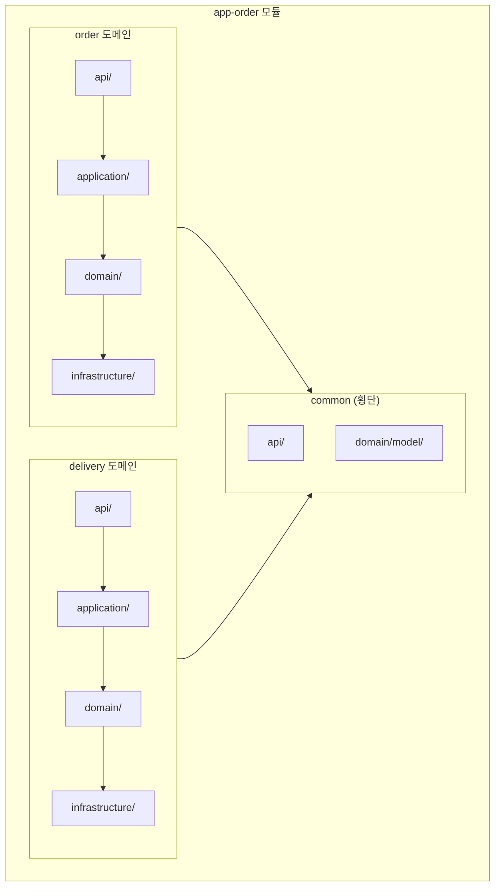
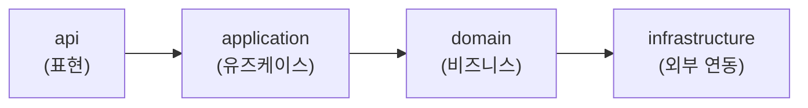
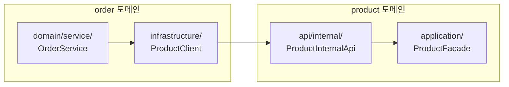
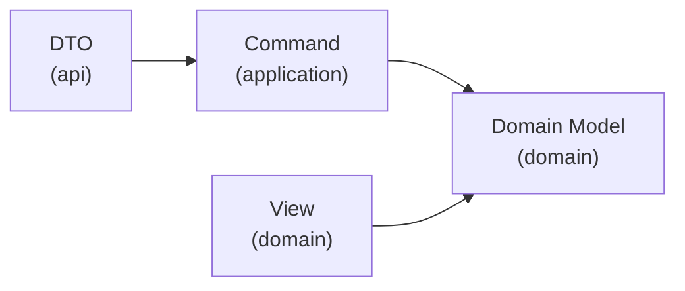
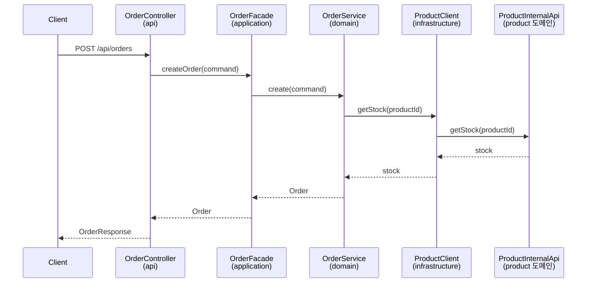
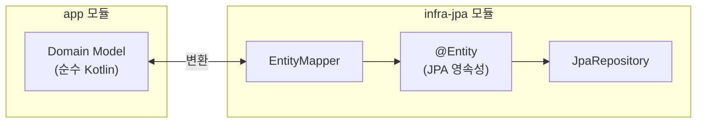

# Domain-First 애플리케이션 아키텍처 가이드

## 목차
- [개요](#개요)
- [패키지 구조](#패키지-구조)
- [레이어 정의](#레이어-정의)
- [레이어 의존 규칙](#레이어-의존-규칙)
- [도메인 간 통신](#도메인-간-통신)
- [데이터 모델](#데이터-모델)
- [코드 예시](#코드-예시)
- [JPA Entity 분리 전략](#jpa-entity-분리-전략)

---

## 개요

app 모듈 내부는 **Domain-First 패키지 구성**을 채택한다. 도메인별로 패키지를 먼저 구성하고, 각 도메인 안에서 4개 레이어로 구분한다.

이 구조는 어떤 비즈니스 도메인에서든 다음 목표를 달성한다:
- **도메인 중심 개발:** 도메인 경계가 명확하여 팀 분업 용이
- **낮은 결합도:** 도메인 간 직접 참조 금지로 독립적 발전 가능
- **테스트 용이성:** 레이어별 책임 분리로 단위 테스트 작성 용이

> **Domain-First vs Layer-First:** 레이어를 먼저 나누고 도메인을 그 아래에 두는 Layer-First 방식 (`controller/order/`, `service/order/`)은 도메인 간 경계가 흐려지기 쉽다. Domain-First는 도메인 단위로 응집도를 높이고, 향후 마이크로서비스 분리 시에도 유리하다.

---

## 패키지 구조

아래는 이커머스 도메인을 예시로 한 구조이다.

```
app-order/
├── order/                         # 주문 도메인
│   ├── api/
│   │   ├── http/                  # HTTP 엔드포인트 (외부 클라이언트용)
│   │   │   ├── OrderController
│   │   │   ├── OrderRequest
│   │   │   └── OrderResponse
│   │   └── internal/              # 내부 통신용 (다른 도메인용)
│   │       └── OrderInternalApi
│   ├── application/
│   │   ├── OrderFacade            # 유즈케이스 시작점
│   │   └── OrderCommand
│   ├── domain/
│   │   ├── model/
│   │   │   ├── Order
│   │   │   └── view/
│   │   │       └── OrderSummaryView
│   │   └── service/
│   │       └── OrderService
│   └── infrastructure/
│       ├── PaymentClient          # 다른 도메인 조회용 클라이언트
│       ├── InventoryClient        # core 모듈 사용
│       └── OrderRepository        # infra 모듈 인터페이스
│
├── delivery/                      # 배송 도메인
│   ├── api/
│   │   ├── http/
│   │   └── internal/
│   ├── application/
│   ├── domain/
│   └── infrastructure/
│
└── common/                        # 공통 (예외적으로 도메인 횡단)
    ├── api/                       # 공통 예외 핸들러 등
    └── domain/model/              # 공유 Value Object (Money, Address 등)
```



---

## 레이어 정의

| 레이어 | 역할 | 포함 내용 |
|--------|------|----------|
| **api** | 표현 계층 | Controller, Request DTO, Response DTO |
| **application** | 유즈케이스 계층 | Facade (유즈케이스 시작점), Command |
| **domain** | 도메인 계층 | Model (순수 Kotlin 객체), Service (도메인 로직) |
| **infrastructure** | 인프라 계층 | infra 모듈 인터페이스, core 모듈 사용 |

### 레이어별 상세

#### api 레이어
- **역할:** 도메인의 외부 인터페이스 제공 (HTTP + 내부 통신)
- **구성요소:**
  - `http/`: 외부 클라이언트용 HTTP 엔드포인트
    - `Controller`: REST 엔드포인트 정의
    - `Request`: 요청 DTO (validation 포함)
    - `Response`: 응답 DTO
  - `internal/`: 다른 도메인용 내부 통신 인터페이스
    - `InternalApi`: 도메인 간 조회용 인터페이스
- **의존 규칙:** application 레이어만 의존

#### application 레이어
- **역할:** 유즈케이스 오케스트레이션
- **구성요소:**
  - `Facade`: 유즈케이스 진입점 (트랜잭션 경계, `@Transactional`)
  - `Command`: 유즈케이스 입력 데이터
- **의존 규칙:** domain 레이어만 의존

> **왜 Facade인가?** Service라는 이름은 도메인 서비스와 혼동된다. Facade는 "여러 하위 시스템을 조합하는 단일 진입점"이라는 디자인 패턴 이름으로, 유즈케이스 오케스트레이터의 역할을 정확히 표현한다.

#### domain 레이어
- **역할:** 핵심 비즈니스 로직
- **구성요소:**
  - `model/`: 도메인 모델 (순수 Kotlin 객체, 프레임워크 의존 없음)
  - `model/view/`: 조회용 읽기 전용 모델 (`~View` 접미사)
  - `service/`: 도메인 서비스 (복잡한 비즈니스 로직)
- **의존 규칙:** infrastructure 레이어만 의존

#### infrastructure 레이어
- **역할:** 외부 시스템 연동 어댑터
- **구성요소:**
  - core 모듈 클라이언트 (NotificationClient 등)
  - infra 모듈 인터페이스 (Repository 등)
  - 다른 도메인 조회 클라이언트 (InternalApi 호출)
- **의존 규칙:** 외부 모듈(core, infra) 의존

---

## 레이어 의존 규칙

### 의존 방향



### 금지 규칙

| 규칙 | 설명 | 위반 예시 |
|------|------|----------|
| 역방향 의존 금지 | 하위 레이어가 상위 레이어 참조 불가 | domain → application (X) |
| 레이어 건너뛰기 금지 | 한 단계씩만 의존 가능 | api → domain (X) |
| 동일 레이어 간 도메인 참조 금지 | 다른 도메인의 같은 레이어 참조 불가 | OrderFacade → DeliveryFacade (X) |

> **왜 건너뛰기를 금지하는가?** Controller가 Service를 직접 호출하면 Facade의 트랜잭션 경계와 유즈케이스 조합이 무력화된다. 각 레이어가 다음 레이어만 호출하도록 강제해야 책임이 명확하게 유지된다.

---

## 도메인 간 통신

### 통신 방식 선택 기준

| 요청 유형 | 방식 | 패턴 | 예시 |
|----------|------|------|------|
| **Write (Command)** | 이벤트 기반 | 발행/구독 | 주문 완료 → 배송 자동 생성 |
| **Read (Query)** | 동기 호출 | Internal API | 주문 처리 전 재고 확인 |

### Write: 이벤트 기반 (Command)

다른 도메인의 상태 변경이 필요한 경우, 이벤트를 발행하고 해당 도메인이 구독하여 처리한다.

- **발행자**: 이벤트만 발행, 구독자를 알지 못함
- **구독자**: 자신의 도메인 로직으로 독립 처리
- **결합도**: 느슨함 (이벤트 스키마만 공유)

```kotlin
// order 도메인: 이벤트 발행
@Component
class OrderService(private val eventPublisher: EventPublisher) {
    fun complete(orderId: String) {
        // 주문 완료 처리 로직
        eventPublisher.publish(OrderCompletedEvent(orderId, shippingAddress))
    }
}

// delivery 도메인: 이벤트 구독
@Component
class OrderEventHandler(private val deliveryFacade: DeliveryFacade) {
    @EventListener
    fun on(event: OrderCompletedEvent) {
        deliveryFacade.createDelivery(event.orderId, event.shippingAddress)
    }
}
```

### Read: Internal API (Query)

다른 도메인의 데이터를 조회하여 조건부 처리가 필요한 경우, Internal API를 통해 동기 호출한다.

- **호출자**: 데이터 필요 시 명시적 요청
- **제공자**: api/internal 레이어에서 조회 인터페이스 제공
- **결합도**: Internal API 계약에 의존

```kotlin
// product/api/internal/ProductInternalApi.kt
@Component
class ProductInternalApi(private val productFacade: ProductFacade) {
    fun getStock(productId: String): Int {
        return productFacade.getStock(productId)
    }
}

// order/infrastructure/ProductClient.kt
@Component
class ProductClient(private val productInternalApi: ProductInternalApi) {
    fun getStock(productId: String): Int {
        return productInternalApi.getStock(productId)
    }
}

// order/domain/service/OrderService.kt
@Component
class OrderService(private val productClient: ProductClient) {
    fun createOrder(command: OrderCommand): Order {
        val stock = productClient.getStock(command.productId)
        require(stock > 0) { "재고 부족" }
        // 주문 생성 로직
    }
}
```



### 기타 통신 방식

| 방식 | 용도 | 예시 |
|------|------|------|
| **common/domain/model/** | 경량 Value Object 공유 | Money, Address, UserId 등 |
| **api/http 조합** | Controller에서 여러 Facade 조합 | 대시보드 API에서 주문+배송 정보 통합 응답 |

---

## 데이터 모델

### 레이어별 데이터 모델

| 레이어 | 데이터 모델 | 설명 |
|--------|------------|------|
| api | DTO | Request, Response |
| application | Command | 유즈케이스 입력 |
| domain | Domain Model | 순수 비즈니스 객체 (일반 + View) |
| infrastructure | (없음) | 데이터 모델을 소유하지 않음 |

### Domain Model 세분화

```
domain/model/
├── Order.kt               # 일반 도메인 모델 (CUD)
├── OrderItem.kt
└── view/                   # 조회용 도메인 모델 (R only)
    ├── OrderSummaryView.kt
    └── OrderDetailView.kt
```

| 구분 | 일반 도메인 모델 | View 모델 |
|------|-----------------|-----------|
| **위치** | `domain/model/` | `domain/model/view/` |
| **네이밍** | `Order`, `OrderItem` | `~View` 접미사 (`OrderSummaryView`) |
| **용도** | 상태 변경 (CUD) | 조회만 (R) |
| **특성** | 비즈니스 로직 포함, 불변식 보장 | 단순 데이터 홀더, 불변 |
| **생성** | Entity에서 변환 | 쿼리 결과에서 직접 매핑 |

### 데이터 모델 간 참조 규칙



| 규칙 | 허용 | 설명 |
|------|:----:|------|
| 동일 레이어 참조 | O | Order → OrderItem (둘 다 Domain Model) |
| 하위 레이어 참조 | O | Command → Domain Model, DTO → Command |
| View → Domain Model | O | OrderSummaryView → Order |
| 상위 레이어 참조 | **X** | Domain Model → Command |
| Domain Model → View | **X** | Order → OrderSummaryView |

---

## 코드 예시

### Controller (api)

```kotlin
@RestController
@RequestMapping("/api/orders")
class OrderController(
    private val orderFacade: OrderFacade  // application 레이어만 의존
) {
    @PostMapping
    fun createOrder(@RequestBody request: CreateOrderRequest): OrderResponse {
        val order = orderFacade.createOrder(request.toCommand())
        return OrderResponse.from(order)
    }

    @GetMapping("/{orderId}")
    fun getOrder(@PathVariable orderId: String): OrderResponse {
        val order = orderFacade.getOrder(orderId)
        return OrderResponse.from(order)
    }
}
```

### Facade (application)

```kotlin
@Component
class OrderFacade(
    private val orderService: OrderService  // domain 레이어만 의존
) {
    @Transactional
    fun createOrder(command: CreateOrderCommand): Order {
        return orderService.create(command)
    }

    @Transactional(readOnly = true)
    fun getOrder(orderId: String): Order {
        return orderService.getById(orderId)
    }
}
```

### Service (domain)

```kotlin
@Component
class OrderService(
    private val productClient: ProductClient,    // infrastructure 레이어만 의존
    private val orderRepository: OrderRepository
) {
    fun create(command: CreateOrderCommand): Order {
        val stock = productClient.getStock(command.productId)
        require(stock >= command.quantity) { "재고 부족: 요청=${command.quantity}, 현재=$stock" }

        val order = Order.create(
            userId = command.userId,
            productId = command.productId,
            quantity = command.quantity
        )
        return orderRepository.save(order)
    }

    fun getById(orderId: String): Order {
        return orderRepository.findById(orderId)
            ?: throw NoSuchElementException("주문을 찾을 수 없습니다: $orderId")
    }
}
```

### Client (infrastructure)

```kotlin
@Component
class ProductClient(
    private val productInternalApi: ProductInternalApi  // 다른 도메인의 Internal API
) {
    fun getStock(productId: String): Int {
        return productInternalApi.getStock(productId)
    }
}
```

### 전체 요청 흐름



---

## JPA Entity 분리 전략

**핵심 원칙:** Entity ≠ Domain Model

| 구분 | 위치 | 역할 |
|------|------|------|
| Domain Model | `app/{도메인}/domain/model/` | 순수 비즈니스 객체 (Kotlin) |
| Entity | `infra-jpa/` | JPA 영속성 객체 (@Entity) |
| EntityMapper | `infra-jpa/` | Entity ↔ Domain Model 변환 |



이 분리를 통해:
- **Domain Model은 JPA에 의존하지 않음** — 순수 Kotlin 객체로 유지
- **테스트 시 JPA 없이 도메인 로직 테스트 가능** — 빠른 단위 테스트
- **영속성 기술 교체 시 app 모듈 수정 불필요** — infra-jpa를 infra-mongodb로 교체해도 Domain Model은 변경 없음

### 변환 예시

```kotlin
// infra-jpa 모듈
@Entity
@Table(name = "orders")
class OrderEntity(
    @Id val id: String,
    val userId: String,
    val productId: String,
    val quantity: Int,
    @Enumerated(EnumType.STRING)
    val status: OrderStatus,
    val createdAt: LocalDateTime
)

// EntityMapper
object OrderEntityMapper {
    fun toEntity(order: Order): OrderEntity = OrderEntity(
        id = order.id,
        userId = order.userId,
        productId = order.productId,
        quantity = order.quantity,
        status = order.status,
        createdAt = order.createdAt
    )

    fun toDomain(entity: OrderEntity): Order = Order(
        id = entity.id,
        userId = entity.userId,
        productId = entity.productId,
        quantity = entity.quantity,
        status = entity.status,
        createdAt = entity.createdAt
    )
}
```
