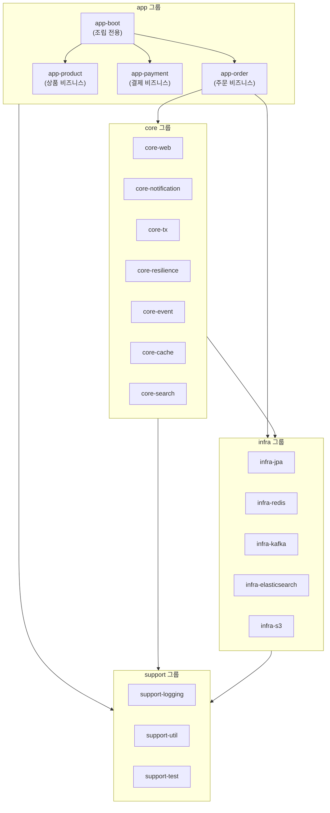
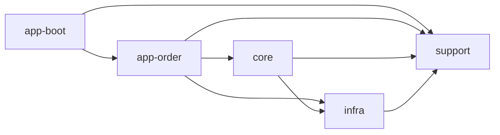

# Kotlin/Spring Boot 멀티모듈 아키텍처 가이드

## 목차
- [개요](#개요)
- [용어 정리](#용어-정리)
- [모듈 그룹 구조](#모듈-그룹-구조)
- [모듈 그룹별 정의](#모듈-그룹별-정의)
  - [app 모듈 그룹](#app-모듈-그룹)
  - [core 모듈 그룹](#core-모듈-그룹)
  - [infra 모듈 그룹](#infra-모듈-그룹)
  - [support 모듈 그룹](#support-모듈-그룹)
- [모듈 의존성 규칙](#모듈-의존성-규칙)
- [Gradle 의존성 설정](#gradle-의존성-설정)
- [네이밍 컨벤션](#네이밍-컨벤션)

---

## 개요

Kotlin/Spring Boot 기반의 멀티모듈 프로젝트에서 **4개 모듈 그룹** 아키텍처를 적용하면 관심사를 명확히 분리하고, 모듈 간 재사용성과 유지보수성을 높일 수 있다.

이 문서는 특정 도메인에 종속되지 않는 범용 아키텍처 패턴을 다룬다. 이커머스, SaaS, 핀테크 등 어떤 도메인이든 동일하게 적용할 수 있다.

**핵심 설계 원칙:**
- 4개 모듈 그룹 (app, core, infra, support) 분리
- 단방향 의존성 (app → core → infra → support)
- 역방향 의존 금지
- 각 그룹별 명확한 책임 영역

---

## 용어 정리

| 용어 | 정의 | 예시 |
|------|------|------|
| **모듈** | Gradle 모듈 (빌드 단위) | app-order, core-notification, infra-jpa 등 |
| **모듈 그룹** | 동일 성격의 모듈 집합 | app, core, infra, support |
| **레이어** | app 모듈 내부의 애플리케이션 아키텍처 계층 | api, application, domain, infrastructure |

> **주의:** "레이어"는 오직 app 모듈 내부 구조에만 사용한다. 모듈 간 구조는 "모듈" 또는 "모듈 그룹"으로 표현한다.

---

## 모듈 그룹 구조

4개 모듈 그룹이 계층적으로 구성되어 명확한 의존 방향을 가진다.



모듈 그룹 간 의존성은 **위에서 아래로 단방향**으로만 흐른다.



---

## 모듈 그룹별 정의

### app 모듈 그룹

**성격:** 비즈니스 로직. 각 app은 독립된 배포 단위. core, infra, support 모두 의존 가능.

| 모듈 | 성격 | 포함 내용 |
|------|------|----------|
| `app-boot` | 조립 전용 | @SpringBootApplication, 설정 클래스, Bean 조립 |
| `app-order` | 주문 비즈니스 | 주문 생성, 주문 상태 관리, 주문 이력 등 |
| `app-product` | 상품 비즈니스 | 상품 등록, 재고 관리, 카테고리 등 |
| `app-payment` | 결제 비즈니스 | 결제 처리, 환불, 정산 등 |
| `app-admin` | (예시) 관리자 | 사용자 관리, 시스템 모니터링 |
| `app-batch` | (예시) 배치 작업 | 스케줄링, 대량 데이터 처리 |

> **app-boot의 역할:** `app-boot`는 비즈니스 로직을 포함하지 않는다. 오직 모든 모듈을 조립하여 실행 가능한 Spring Boot 애플리케이션을 만드는 것이 유일한 책임이다.

### core 모듈 그룹

**성격:** 재사용 가능한 공통 컴포넌트. infra를 조합해서 고수준 기능 제공. app을 모른다 (역방향 의존 없음).

| 모듈 | 성격 | 포함 내용 |
|------|------|----------|
| `core-web` | 웹 공통 기능 | 공통 예외 처리, API 응답 포맷, 인증/인가 필터 |
| `core-notification` | 알림 통합 | 알림 추상화 (Slack, Email, Push 등 infra 조합) |
| `core-tx` | 트랜잭션 관리 | 트랜잭션 템플릿, 분산 트랜잭션, Saga 패턴 |
| `core-resilience` | 장애 회복 | Circuit Breaker, Retry, Timeout, Fallback |
| `core-event` | 이벤트 처리 | 이벤트 발행/구독, 비동기 처리, 이벤트 소싱 |
| `core-cache` | 캐시 통합 | 캐시 추상화, 다중 캐시 전략 (Local + Redis 조합) |
| `core-search` | 검색 통합 | 검색 추상화, Elasticsearch 조합, 인덱싱 전략 |

> **core의 핵심 가치:** core는 app을 모르므로, 다른 프로젝트에서 그대로 재사용할 수 있다. 예를 들어 `core-notification`을 이커머스와 SaaS 프로젝트 모두에서 사용 가능하다.

### infra 모듈 그룹

**성격:** 외부 시스템과의 순수 연동. 단일 책임 (하나의 외부 시스템만 담당). 비즈니스 로직 없음.

| 모듈 | 성격 | 포함 내용 |
|------|------|----------|
| `infra-jpa` | DB 연동 | @Entity, JpaRepository, EntityMapper (Entity ↔ Domain 변환) |
| `infra-redis` | Redis 연동 | RedisTemplate, 캐시/세션 저장소 |
| `infra-kafka` | Kafka 연동 | Producer/Consumer, 토픽 설정 |
| `infra-elasticsearch` | 검색엔진 연동 | Elasticsearch 클라이언트, 인덱스 관리 |
| `infra-s3` | S3 연동 | 파일 업로드/다운로드 |
| `infra-slack` | Slack API | 메시지 전송 클라이언트 |
| `infra-email` | 이메일 전송 | SMTP/SES 클라이언트 |

> **infra의 핵심 원칙:** 각 infra 모듈은 단 하나의 외부 시스템만 담당한다. `infra-jpa`가 Redis를 알거나, `infra-kafka`가 Elasticsearch를 참조하는 것은 금지된다. infra 모듈 간 의존도 금지한다.

### support 모듈 그룹

**성격:** Cross-cutting concerns. 모든 모듈에서 의존 가능. 비즈니스 무관한 순수 유틸리티.

| 모듈 | 성격 | 포함 내용 |
|------|------|----------|
| `support-logging` | 로깅 | 구조화된 로깅, MDC 관리, 로그 포맷 |
| `support-util` | 공통 유틸리티 | 날짜/시간, 문자열, JSON 유틸 |
| `support-test` | 테스트 지원 | 테스트 픽스처, Mock 빌더, 테스트 유틸 |

> **support의 특성:** support는 어떤 모듈에도 의존하지 않는다. 가장 하위에 위치하며, 의존 그래프의 리프 노드 역할을 한다.

---

## 모듈 의존성 규칙

| From | To | 허용 | 설명 |
|------|----|:----:|------|
| app-boot | 전체 | O | 조립 전용, 모든 모듈 의존 |
| app | core | O | 공통 컴포넌트 사용 (tx, resilience, notification, cache, event 등) |
| app | infra | O | DB 등 직접 접근 가능 |
| app | support | O | 로깅 등 cross-cutting 유틸리티 |
| core | infra | O | infra 조합해서 고수준 기능 제공 |
| core | support | O | cross-cutting 유틸리티 |
| core | app | **X** | **역방향 의존 금지** |
| infra | support | O | cross-cutting 유틸리티 |
| infra | app | **X** | **역방향 의존 금지** |
| infra | core | **X** | **역방향 의존 금지** |
| infra | infra | **X** | **infra 간 의존 금지** |

**핵심 원칙:**
- **단방향 의존:** app → core → infra → support
- **역방향 의존 금지:** 하위 모듈이 상위 모듈을 참조할 수 없음
- **infra 간 의존 금지:** infra 모듈끼리 서로 참조 불가
- **core 재사용:** core는 app을 모르므로 다른 프로젝트에서 재사용 가능

> **왜 단방향인가?** 의존 방향을 엄격히 제한하면, 하위 모듈의 변경이 상위 모듈에 영향을 주지 않는다. 예를 들어 `infra-jpa`를 `infra-mongodb`로 교체해도 core 모듈은 수정할 필요가 없다.

---

## Gradle 의존성 설정

### app-boot (조립 전용)

```kotlin
// app-boot/build.gradle.kts
dependencies {
    implementation(project(":app-order"))
    implementation(project(":app-product"))
    runtimeOnly(project(":core-notification"))
    runtimeOnly(project(":core-event"))
    runtimeOnly(project(":infra-jpa"))
    runtimeOnly(project(":infra-kafka"))
    implementation(project(":support-logging"))
}
```

> `runtimeOnly`를 사용하면 app-boot의 컴파일 시점에는 해당 모듈을 참조하지 않으므로, 조립 전용이라는 역할을 코드 레벨에서 강제할 수 있다.

### app-order (비즈니스 로직)

```kotlin
// app-order/build.gradle.kts
dependencies {
    implementation(project(":core-event"))
    implementation(project(":core-notification"))
    implementation(project(":infra-jpa"))       // DB 직접 접근
    implementation(project(":support-logging"))
}
```

### core-notification (공통 컴포넌트)

```kotlin
// core-notification/build.gradle.kts
dependencies {
    implementation(project(":infra-slack"))
    implementation(project(":infra-email"))
    implementation(project(":support-logging"))
}
```

### infra-* (외부 시스템 연동)

```kotlin
// infra-jpa/build.gradle.kts
dependencies {
    implementation(project(":support-logging"))
    // 외부 라이브러리만 의존
    implementation("org.springframework.boot:spring-boot-starter-data-jpa")
    runtimeOnly("org.postgresql:postgresql")
}
```

### api() vs implementation() 사용 기준

| 스코프 | 용도 | 예시 |
|--------|------|------|
| `api()` | 전이적 인터페이스 노출이 필요할 때 | infra 모듈이 app 모듈의 인터페이스를 전이적으로 제공해야 할 때 |
| `implementation()` | 내부 구현 의존 | 대부분의 모듈 간 의존 |
| `runtimeOnly()` | 런타임에만 필요한 조립용 의존 | app-boot에서 자동구성 모듈 등록 |

---

## 네이밍 컨벤션

모듈 이름은 `{그룹}-{이름}` 형식을 따른다.

| 그룹 | 예시 | 설명 |
|------|------|------|
| app | app-boot, app-order, app-product, app-admin | 애플리케이션 모듈 |
| core | core-web, core-notification, core-tx, core-event | 공통 컴포넌트 |
| infra | infra-jpa, infra-redis, infra-kafka, infra-s3 | 외부 시스템 어댑터 |
| support | support-logging, support-util, support-test | 횡단 관심사 |

### 패키지 컨벤션

| 모듈 그룹 | 패키지 패턴 | 예시 |
|----------|------------|------|
| app | `com.{회사}.{서비스}.{도메인}.{레이어}` | `com.example.shop.order.api.http` |
| core | `com.{회사}.core.{모듈명}` | `com.example.core.notification` |
| infra | `com.{회사}.infra.{외부시스템}` | `com.example.infra.jpa` |
| support | `com.{회사}.support.{모듈명}` | `com.example.support.logging` |
