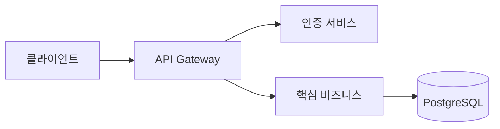

# docs/ 문서화 규칙

## 디렉토리 구조
```
docs/{번호}-{feature-name}/
├── index.md              ← Tasks 체크리스트
├── learning/             ← 범용 기술/개념 (영구)
└── design/               ← 프로젝트 특화 설계
```

## 파일 규칙
- **파일명**: 소문자, 하이픈 구분 (예: `vector-embedding.md`)
- **목차**: 모든 md에 H1 바로 아래 목차 포함
- **언어**: 한국어 기본, 기술용어 영어 허용

## learning/ vs design/ 판단

| 내용 | learning/ | design/ |
|------|:---------:|:-------:|
| 범용 기술 이론/개념 | ✅ | |
| 기술 비교/분석 | ✅ | |
| 알고리즘/패턴 설명 | ✅ | |
| 우리 시스템 설계 결정 | | ✅ |
| DB 스키마, API 설계 | | ✅ |
| 우리 시스템 설정값 | | ✅ |

**판단 질문**: 
- "다른 프로젝트에서도 유용한가?" → Yes: learning/
- "우리 시스템 고유의 결정인가?" → Yes: design/

## learning/ 규칙
- **출처 명시 필수** (공식문서, 논문 등)
- **복잡한 개념은 다이어그램 활용** (알고리즘 흐름, 개념 관계도 등)
- 허용: 개념, 이론, 비교 분석, 트레이드오프
- 금지: 프로젝트 특화 설계, 구체적 코드

## design/ 규칙
- **추상화 유지** (구현 독립적)
- **다이어그램 필수** (복잡한 설계는 Mermaid로 시각화)
- 허용: DB 스키마, API, 아키텍처, 결정 근거
- 금지: 범용 기술 개념

## 다이어그램 활용 규칙

**기본 원칙**: 텍스트만으로 이해하기 어려운 구조/흐름은 **반드시 Mermaid 다이어그램**으로 시각화

### 다이어그램이 필수인 경우
- **아키텍처 설계**: 시스템 구성요소 간 관계
- **데이터 흐름**: 요청/응답 흐름, 데이터 파이프라인
- **DB 스키마**: 테이블 관계, ERD
- **상태 전이**: 상태 머신, 워크플로우
- **시퀀스**: API 호출 순서, 컴포넌트 간 상호작용
- **계층 구조**: 클래스 상속, 디렉토리 구조

### Mermaid 다이어그램 종류별 용도

| 다이어그램 | 용도 | 예시 |
|-----------|------|------|
| **flowchart** | 프로세스 흐름, 의사결정 트리 | 요청 처리 로직, 배포 절차 |
| **sequenceDiagram** | 시간 순서 상호작용 | API 호출 시퀀스, 서비스 간 통신 |
| **erDiagram** | DB 스키마, 엔티티 관계 | 테이블 구조, 외래키 관계 |
| **classDiagram** | 클래스/모듈 구조 | 서비스 계층, 도메인 모델 |
| **stateDiagram** | 상태 전이 | 주문 상태, 워크플로우 |
| **gitGraph** | 브랜치 전략 | Git 워크플로우 |

### 작성 가이드
```markdown
## 시스템 아키텍처

{1-2문장 개요}



{다이어그램 설명 - 주요 컴포넌트, 흐름, 의사결정 근거}
```

### 금지 사항
- ❌ 복잡한 시스템을 텍스트로만 설명
- ❌ "나중에 추가" 하려고 비워두기
- ❌ 다이어그램 없이 "아래 그림 참조" 같은 빈 참조

### 권장 사항
- ✅ 간단한 구조도 다이어그램으로 시각화 (이해도 향상)
- ✅ learning/에서도 복잡한 개념은 다이어그램 활용
- ✅ 한글 라벨 사용 (가독성 우선)

## index.md 라이프사이클
| 단계 | 내용 |
|------|------|
| 진행 중 | Phase별 TODO + 학습/설계 링크 |
| 완료 후 | TODO 제거 → 학습 목차로 전환 |

## 예시

### learning/ 예시
- `vector-embedding.md` - 벡터 임베딩 개념, 모델 비교
- `pgvector-indexing.md` - IVFFlat vs HNSW 인덱스
- `reciprocal-rank-fusion.md` - RRF 알고리즘 설명

### design/ 예시
- `database-schema.md` - 우리 시스템 테이블 설계
- `service-architecture.md` - 우리 시스템 서비스 구조
