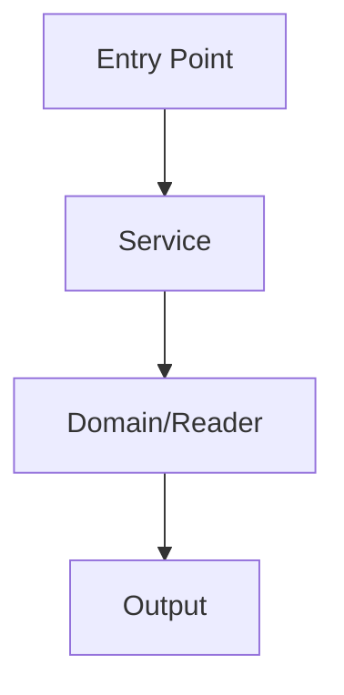

# Jira Task Workflow

Run a Jira-linked task sequence with a strict review gate. By default, use this skill only for company/work Jira workflows. For non-company or personal projects, do not auto-activate this skill unless the user explicitly asks to use `jira-task-workflow`.

## Purpose

Use this skill when work must proceed item-by-item and each item needs:

1. task identification
2. Jira ticket lookup
3. planning
4. user review/approval
5. execution
6. verification/review
7. tracking document update
8. Jira status synchronization

Do not use this skill for a single ad-hoc Jira lookup; use `jira-direct` instead.

## Activation Scope Guard

Default activation scope: **company/work Jira task workflows only**.

Use this skill automatically only when at least one of the following is true:

- The user refers to company/work Jira issues, company project work, or a known work project key such as `SH`.
- The current workspace/repository is a company work repository and the request involves Jira-linked implementation tasks.
- The user asks to execute Jira subtasks from a company planning document or backend requirements document.
- The user explicitly says to use `jira-task-workflow`.

Do **not** auto-use this skill for personal projects, open-source projects, or unrelated Jira instances. In those cases, use normal planning or ask whether the user wants this workflow.

## Related Skills

- `jira-direct`: use for Jira REST API reads/writes and helper scripts.
- Project-specific implementation/testing skills still apply after the user approves execution.

## Source Priority

Resolve the workflow source in this order:

1. **Document Jira mapping table**
   - Prefer a markdown table with columns equivalent to: `번호`, `하위작업`, `Jira 티켓`.
   - Example heading: `Jira 티켓 매핑`.
2. **Jira parent issue subtasks**
   - Use the parent issue's subtasks/children.
   - Sort by `[01]`, `[02]` prefix if present; otherwise sort by issue key ascending unless the user provides another order.
3. **User-provided task list**
   - If Jira keys are missing, ask whether to link existing Jira tickets, create new Jira tickets, or proceed without Jira linkage.

## Tracking Document Policy

Use an index document plus per-task detail files. This avoids a single oversized workflow document.

- The index document is the canonical task index and status summary.
- Per-task detail files are the canonical execution log for each task.
- Default index path when source is a document:
  - `<source-document-directory>/jira-task-workflow.md`
- Default detail directory when source is a document:
  - `<source-document-directory>/jira-task-workflow/`
- Default index path when source is only a Jira parent:
  - `docs/jira-task-workflow/<PARENT_KEY>.md`
- Default detail directory when source is only a Jira parent:
  - `docs/jira-task-workflow/<PARENT_KEY>/`
- Detail file naming convention:
  - `<NN>-<ISSUE_KEY>.md`, e.g. `01-SH-20437.md`
  - If no Jira key exists, use `<NN>-no-jira.md`.
- Do not use Jira comments as the primary execution log.
- Jira is used for issue identity, assignee/status lookup, and status synchronization.
- If the user asks to attach/connect/link planning materials to a task, first add local markdown links in the task detail file.
- Do not upload files to Jira unless the user explicitly asks for Jira attachments.

### Tracking Document Initial Template

Create the tracking document if it does not exist:

```markdown
# Jira Task Workflow

## Workflow Source

- Source document: `<path or none>`
- Jira parent: `<parent key or none>`
- Mode: `<document-mapping | jira-parent | user-list>`
- Created at: `<YYYY-MM-DD>`

## Workflow Rules

- This document is the canonical task index and status summary for Jira-linked tasks.
- Each task's detailed plan/execution/verification log lives in a linked per-task detail file.
- Tasks are executed in Task Index order unless the user specifies a task number or Jira key.
- Each task must follow: plan → user review → execution → verification/review.
- Do not execute implementation changes before explicit user approval.
- Do not use Jira comments as the primary execution log.
- Synchronize Jira status at every required workflow point. Never leave tracking status and Jira lifecycle status inconsistent without recording why.

## Task Index

| 번호 | 작업명 | Jira 티켓 | 상태 | 최근 메모 | 상세 기록 |
|------|--------|-----------|------|-----------|-----------|

## Task Detail Files

- Create one detail file per task in the detail directory.
- Link each detail file from the `상세 기록` column in Task Index.
- Keep the index concise: status, latest note, and link only.
- Do not append all task logs into this index document.

Example detail file path:

- `jira-task-workflow/01-SH-20437.md`
```

For every task, create a detail file:

```markdown
# <번호>. <작업명>

- Jira: `<ISSUE_KEY or none>`
- Status: `대기`
- Source: `<source document section / Jira parent / user list>`

## Plan

작성 전.

## User Review

대기.

## Execution Result

대기.

## Verification Result

대기.

## Open Issues

없음.
```

Task detail markdown heading rule:

- Use `##` for major sections such as `Plan`, `User Review`, `Execution Result`, `Verification Result`, `Open Issues`.
- Inside those sections, prefer `####` for subtopics such as linked materials, current structure, goal, implementation approach, verification plan, target files, or open questions.
- Prefer a two-level heading structure of `##` and `####` for readability; avoid unnecessary `###` unless the user explicitly wants a different format.

For flow-analysis, architecture-discovery, or process-tracing tasks, include a Mermaid diagram in `Execution Result`:

````markdown
### Mermaid 흐름도


````

Use Mermaid when it helps the next implementation task understand call order, responsibility boundaries, or data flow.

If the tracking document already exists, do not overwrite it. Compare the source and tracking document for:

- task number mismatch
- task title mismatch
- Jira key mismatch
- source-only tasks
- tracking-only tasks

Report mismatches and ask for approval before synchronizing the tracking document.

## Workflow Status Model

Tracking document statuses:

| Status | Meaning |
|--------|---------|
| 대기 | Not started |
| 계획 작성 | Plan is being written or has been written |
| 승인 대기 | Waiting for user review/approval |
| 진행 중 | Approved and execution is in progress |
| 검증 중 | Execution complete; verification/review in progress |
| 완료 | Verification complete |
| 차단됨 | Blocked by missing info/decision/dependency |
| 재작업 필요 | Verification or user review requires changes |
| 보류 | Intentionally deferred |
| 취소 | Removed from scope |

Tracking status is the workflow execution status. Jira status is the ticket lifecycle status. Do not assume they are identical.

### Mandatory Status Synchronization Matrix

When changing a tracking status, immediately evaluate and perform the matching Jira transition if possible:

| Tracking status | Required Jira action |
|-----------------|----------------------|
| `승인 대기` | Usually no Jira transition. Keep Jira as To-do unless the user explicitly requests otherwise. |
| `진행 중` | Transition Jira to `진행 중` / `In Progress` before or immediately after starting execution. |
| `검증 중` | Jira may remain `진행 중`; do not move to done yet unless verification is complete and completion is approved. |
| `완료` | Transition Jira to `Close` / `Done` / `완료`. If no transition exists, report available transitions and keep a blocker note. |
| `취소` | Transition Jira to `Hold`, `Canceled`, or the closest available non-active status. |
| `보류` / `차단됨` | Transition Jira to `Hold` / `Blocked` if available. |
| `재작업 필요` | Keep or move Jira to `진행 중` / `In Progress` if work must continue. |

A task is not truly finished until both are true:

1. tracking document status/result is updated, and
2. Jira status has been synchronized or an explicit synchronization blocker is recorded.

## Task Selection Rules

- “다음 작업” means the lowest-numbered task that is not `완료` or `취소`.
- “1번 작업” means task number 1.
- “3번부터 진행” means task number 3 becomes the current task.
- “SH-20439 진행” means the task mapped to that Jira key.
- “마지막까지 진행” does **not** mean automatic batch execution. Repeat the approval-gated loop for each task.
- If the user wants to skip a task, ask whether to mark it `보류` or `취소`.
- If the user wants to redo a task, mark it `재작업 필요` or move it back to `진행 중` after confirmation.

## Approval Gate

Each task must have an explicit approval gate.

### Allowed before approval

Before user approval, you may:

- read requirements/tracking docs
- read Jira tickets
- search/read code
- inspect related files
- analyze impact
- write the plan into the tracking document
- set tracking status to `계획 작성` or `승인 대기`

### Forbidden before approval

Before explicit approval, do not:

- edit implementation code
- edit configuration or migrations
- change Jira status
- add Jira comments
- mark work complete
- run commands that cause persistent side effects

Tracking document updates for plan/status are the only allowed write before approval.

### Phrases considered approval

Treat these as approval to execute the planned task:

- `승인`
- `진행`
- `작업 시작`
- `구현해`
- `계속해`
- `좋아`
- `OK`
- `go`
- `이대로 진행`
- `계획대로 진행`

Do not treat these as approval:

- `검토해줘`
- `더 자세히`
- `다른 방법은?`
- `수정해줘`
- `보완해줘`
- `질문`
- `잠깐`

If not approved, revise/explain the plan and keep the task in `승인 대기`.

## Per-Task Procedure

For each task:

1. **Identify**
   - Find task number, title, Jira issue key, source reference.
2. **Inspect Jira**
   - Check issue status, assignee, parent, available transitions if status sync may be needed.
3. **Investigate**
   - Read relevant docs/code.
   - Follow project-specific rules and AGENTS instructions.
4. **Plan**
   - Write a concise plan including:
     - objective
     - scope
     - affected files/modules
     - implementation approach
     - verification method
     - risks/open questions
   - When recording the plan in the task detail file, structure it with `## Plan` and `####` subheadings for readability.
5. **Record Plan**
   - Update the per-task detail file.
   - Update the index row status/latest note/link.
   - Set tracking status to `승인 대기`.
6. **Wait for Approval**
   - Stop and ask the user to review.
7. **Execute after Approval**
   - Set tracking status to `진행 중`.
   - Transition Jira to in-progress status if configured and possible.
   - Perform the planned work.
8. **Verify**
   - Set tracking status to `검증 중`.
   - Run allowed verification for the project.
   - Respect project-specific forbidden commands.
9. **Record Result**
   - Update execution result, verification result, and open issues in the per-task detail file.
   - Keep task detail headings consistent: major result sections with `##`, subtopics with `####`.
   - Update the index row with the latest status/note/link.
   - If related requirements/screenshots need to be attached to the task record, add markdown links to local source files in the detail file first.
10. **Complete**
    - Set tracking status to `완료` only after verification is acceptable.
    - Transition Jira to done/close when the user explicitly approves completion, asks to commit and move on, or asks to proceed to the next task after a completed implementation.
    - If completion approval is ambiguous, ask before closing Jira; do not silently leave Jira in `진행 중`.
11. **Next Task**
    - Before proposing the next incomplete task, run the completion checklist:
      1. per-task detail file updated,
      2. index row updated,
      3. Jira status synchronized or blocker recorded,
      4. commit created if the task produced code/doc changes and the user requested commit-per-step.
    - Propose the next incomplete task only after the checklist is complete.

## Jira Status Synchronization

Use Jira status synchronization only; do not add Jira comments by default.

Default target status candidates:

- Start execution: `진행 중`, `In Progress`
- Complete after user approval / commit-and-next approval: `Close`, `Done`, `완료`
- Canceled/deferred: `Hold`, `Canceled`, `Cancelled`, `취소`, `보류`
- Blocked: `Hold`, `Blocked`, `보류`

Hard rules:

1. Query available transitions for the current issue before every Jira status change.
2. Match the target status by transition target name or id.
3. If no transition matches, show available transitions and record the sync blocker in the task detail file.
4. Do not force or guess a Jira status transition.
5. Do not transition Jira to done/close before work is verified.
6. If the user says a completed step should be committed and moved on, treat that as completion approval and close/done the Jira issue if a valid transition exists.
7. If tracking says `완료` but Jira is still `진행 중`, fix Jira immediately before moving to the next task.
8. If tracking says `취소` but Jira is still `To-do` or `진행 중`, move Jira to `Hold`/cancel-like status immediately if available.

### Resume/Reconciliation Procedure

When resuming a Jira task workflow or before selecting the next task:

1. Read the workflow index and identify all tasks with status `진행 중`, `검증 중`, `완료`, `취소`, `보류`, or `차단됨`.
2. Query Jira status for the current task and any recently completed/canceled tasks.
3. Reconcile mismatches before continuing:
   - tracking `완료` + Jira `진행 중`/`To-do` → transition Jira to done/close or record blocker.
   - tracking `취소`/`보류` + Jira active → transition Jira to hold/cancel-like status or record blocker.
   - tracking `진행 중` but implementation already committed/verified → update tracking result, then close Jira if approved.
4. Report the synchronization result briefly to the user.

## User Input Examples

- `backend-requirements.md의 Jira 티켓 매핑 순서대로 진행하자`
- `SH-18440 하위작업을 1번부터 마지막까지 진행하자`
- `다음 Jira 작업 계획 세워줘`
- `3번 작업부터 진행해줘`
- `SH-20439 작업 계획 수립해줘`
- `각 작업은 계획 먼저 세우고 내가 승인하면 실행해줘`

## Output Style

- Respond concisely.
- Clearly state current task number, title, and Jira key.
- When asking for approval, include exactly what will be changed and how it will be verified.
- If blocked, state the blocker and what decision/info is needed.
