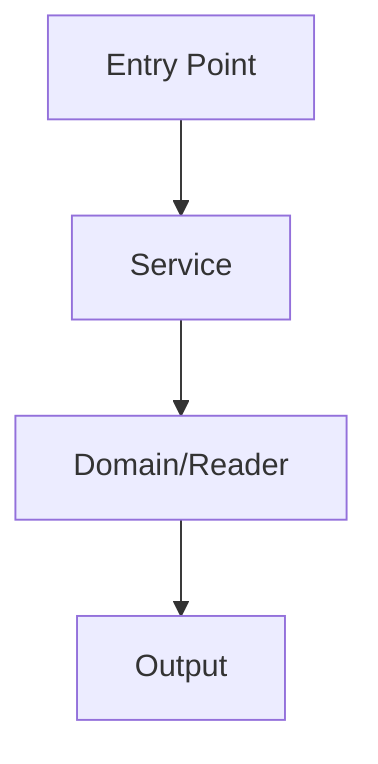
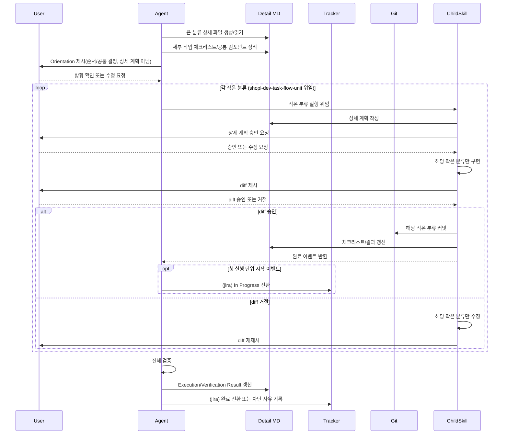

# Task Workflow

사용자 승인 게이트가 있는 트래커 연동 작업 시퀀스를 실행한다. 트래커 모드(`jira` / `linear` / `local`)에 따라 연동 방식이 달라진다.

## 빠른 실행 요약

1. 트래커 모드 결정 (`jira` / `linear` / `local`)
2. 인덱스/상세 파일 setup
3. 큰 분류 Orientation + 방향 확인
4. 작은 분류는 `shopl-dev-task-flow-unit` 호출
5. 작은 분류 완료 이벤트를 부모가 받아 트래커 상태 동기화 판단
6. 큰 분류 전체 검증 후 완료 처리

원칙:
- **부모 스킬** = setup / 큰 분류 / 검증 / 트래커 상태 동기화
- **자식 스킬** = 작은 분류 1개 계획 / 승인 / 구현 / diff / 커밋
- **트래커 상태 전환은 항상 부모 스킬이 수행**한다. 자식은 전환 필요 이벤트만 반환한다.

## 트래커 모드

워크플로우 초기화 단계에서 트래커 모드를 결정한다. 모드가 명시되지 않았을 때 규칙은 아래와 같다.

- Jira 키/상위 티켓이 명확하면 `jira`로 추론 가능
- Linear 이슈 키/팀 컨텍스트가 명확하면 `linear`로 추론 가능
- 그 외에는 반드시 사용자에게 `jira` / `linear` / `local` 중 하나를 물어본다
- **암묵적 기본값은 없다.** 문맥이 불충분하면 임의로 `jira`를 선택하지 않는다

| 모드 | 설명 | 티켓 생성 | 상태 동기화 |
|------|------|-----------|-------------|
| `jira` | Jira REST API를 통한 티켓/상태 연동 | `shopl-work-jira-direct` 스킬로 생성 | 동기화 매트릭스 따라 전환 |
| `local` | 외부 트래커 없음. 작업은 마크다운 추적 문서만으로 관리 | 생성하지 않음 | 없음 |
| `linear` | API 헬퍼 준비 전의 scaffold/manual 모드. 티켓 참조는 수동 입력, 상태는 추적 문서로 관리 | 자동 생성 없음 | 현재 자동 동기화 없음 |

트래커 모드는 워크플로우 인덱스 문서에 기록되어 모든 실행자가 일관된 모드로 작업한다.

## 용도

작업을 하나씩 순차 진행해야 하고 각 작업이 아래 항목을 필요로 할 때 사용한다.

1. 작업 식별
2. 트래커 티켓 조회 (모드에 따라)
3. 계획 수립
4. 사용자 검토/승인
5. 실행 (작은 분류 루프는 `shopl-dev-task-flow-unit` 위임)
6. 검증/리뷰
7. 추적 문서 갱신
8. 트래커 상태 동기화

단발성 조회에는 이 스킬을 사용하지 말고 전용 조회 스킬을 사용한다.

## 활성화 범위

다음 중 하나라도 해당하면 이 스킬을 사용할 수 있다. 사용자가 트래커 모드를 명시하지 않으면 위 규칙에 따라 추론하거나 질문한다.

- 사용자가 Jira/Linear 티켓, 하위작업, 또는 `SH` 같은 알려진 업무 프로젝트 키를 언급한 경우.
- 현재 작업 컨텍스트가 구현 작업이고 문서 기반 진행이 필요한 경우.
- 사용자가 "작업 계획 세워서 승인받고 진행해줘" 같은 워크플로우 진행을 요청한 경우.
- 사용자가 명시적으로 `task-workflow` 사용을 말한 경우.

개인 프로젝트나 단발성 질의에는 자동 활성화하지 않는다. 그런 경우 일반 계획 수립을 하거나 사용자에게 이 워크플로우를 원하는지 물어본다.

## 관련 스킬

- `shopl-work-jira-direct`: Jira REST API 읽기/쓰기 헬퍼 (`jira` 모드용).
- `shopl-dev-task-flow-unit`: 작은 분류(실행 단위) 1개의 상세 계획 → 승인 → 구현 → diff 검토 → 커밋을 처리한다. 이 스킬의 작은 분류 루프에서 호출한다.
- `shopl-work-linear-direct`: 향후 `linear` 자동 연동이 필요해질 때 추가할 후보 스킬. 현재는 존재하지 않는다.
- 프로젝트별 구현/테스트 스킬은 사용자가 실행을 승인한 이후에도 적용된다.

## 소스 우선순위

아래 순서로 워크플로우 소스를 결정한다.

1. **문서 내 작업 매핑 테이블**
    - `번호`, `하위작업`, `티켓`에 해당하는 열이 있는 마크다운 테이블을 우선 사용.
    - 예시 헤딩: `작업 매핑`.
2. **트래커 상위 이슈의 하위작업**
    - 상위 이슈의 하위작업/자식 이슈를 사용. (Jira에만 해당 — `jira` 모드)
    - `[01]`, `[02]` 접두사가 있으면 그 순서로 정렬. 없으면 사용자가 다른 순서를 지정하지 않는 한 키 오름차순.
3. **사용자 제공 작업 목록**
    - 티켓 키가 없으면 트래커 연동할지, 새 티켓을 생성할지, 연동 없이(`local`) 진행할지 물어본다.

## 백엔드 분해 문서 연계

`shopl-dev-backend-breakdown-from-scrap` 스킬의 산출물을 입력 소스로 받은 경우, 아래 규칙을 적용한다.

### 소스 식별

- 소스 문서 내 `## 15. 구현 하위작업` 섹션을 기본 소스로 사용한다.
- 해당 섹션의 `### 큰 분류 N. <작업명>` 각 항목이 **티켓 1개**가 된다.
- `큰 분류` 앞에 `공통 컴포넌트 매핑표`가 있으면 함께 읽어서 연관 관계를 파악한다.

### 큰 분류 → 작업 티켓 변환 규칙

1. **큰 분류 1개 = 작업 티켓 1개 = 로컬 상세 md 1개**.
2. 큰 분류의 번호(`N`)와 제목(`<작업명>`)은 티켓 제목과 로컬 md 파일명에 그대로 보존한다.
3. 큰 분류의 순서는 Task Index의 `번호` 순서가 된다.
4. 소스 문서에 티켓이 이미 매핑되어 있으면 그대로 사용한다.
5. 매핑이 없으면 **워크플로우 초기화 단계에서 트래커 모드에 따라 일괄 등록 또는 기록**한다. 큰 분류 진입 시점에 개별 생성하지 않는다. 작업 실행 전 전체 백로그가 정리되어 있어야 한다.
6. **티켓 제목 끝에 난이도/공수 점수를 소괄호로 표기한다.** 형식: `<작업명> (N점)`. `N`은 1~10 정수(산정 기준은 아래). 점수는 워크플로우 초기화에서 산정되어 티켓 생성 시점에 제목에 함께 반영된다. 제목 본문은 건드리지 않고 점수만 끝에 붙인다.

### 난이도/공수 점수 산정 기준

`(N점)` 은 해당 큰 분류의 구현 난이도와 공수를 합친 종합 점수다. **워크플로우 초기화 단계에서 전체 큰 분류를 일괄 산정**한다. Orientation 단계에서는 재산정하지 않고 초기화에서 정한 점수를 확인만 한다.

| 점수 | 기준 |
|------|------|
| 1~2 | 단순 CRUD, 설정 변경, 단일 파일 수정. 영향 범위 좁음. |
| 3~4 | 1~2개 도메인 건드리는 일반 기능. 익숙한 패턴. |
| 5~6 | 다수 도메인 연동, 공통 컴포넌트 생성, 신규 API 설계. |
| 7~8 | 도메인 구조 변경, 마이그레이션, 외부 시스템 연동. |
| 9~10 | 핵심 도메인 대규모 리팩터링, 설계 원점 재검토 필요. |

### 작은 분류 → 티켓 내 세부 작업

1. 큰 분류 안의 `- 작은 분류` 각 항목은 **해당 티켓의 세부 작업**이다.
2. 로컬 상세 md 파일(`## Plan` 섹션)에 작은 분류 목록을 체크리스트로 기록한다.
3. 작은 분류의 접두사 태그(`[골격]`, `[공통/대상자]`, `[API]`, `[Excel]` 등)는 보존하여 작업 성격을 구분한다.
4. 티켓 Description에는 큰 분류 제목만 기재한다. 세부 작업은 유동적이므로 티켓에 기록하지 않고 로컬 md가 정본이다.

### 로컬 상세 md 구성

- 큰 분류별로 상세 md를 생성한다.
- 파일명: `<번호>-<큰분류-간략명>.md` (예: `01-주간-요약-시트-생성-API.md`). 티켓 키가 확정되면 `<번호>-<티켓키>.md`로 갱신한다.
- 추적 문서 정책의 기본 템플릿(Plan/User Review/Execution Result/Verification Result/Open Issues)을 그대로 사용하되, `## Plan` 앞에 아래 섹션을 추가한다:

```markdown
## 세부 작업 체크리스트

- [ ] <작은 분류 1>
- [ ] <작은 분류 2>
- ...

## 공통 컴포넌트 관계

- 생성: `<목록 or 없음>`
- 재사용: `<목록 or 없음>`

## Orientation

- 난이도/공수: `N점 (초기화 산정값, 여기서 재산정하지 않음)`
- 실행 순서: `<작은 분류 순서>`
- 공통 결정: `<공통 컴포넌트/데이터 모델/재사용 결정>`
- 주의: 큰 분류 전체 상세 계획을 한 번에 확정하지 않는다. 상세 계획은 `shopl-dev-task-flow-unit`에서 작은 분류별로 작성한다.
```

### 공통 컴포넌트 매핑표 반영

- 소스 문서의 `공통 컴포넌트 매핑표`가 있으면, 각 큰 분류 상세 md의 `공통 컴포넌트 관계` 섹션에 반영한다.
- `구현 위치`에 해당하는 큰 분류는 `이 작업이 생성하는 공통 컴포넌트`로 기록한다.
- `재사용하는 API 작업`에 해당하는 큰 분류는 `이 작업이 재사용하는 공통 컴포넌트`로 기록하고, 소스 위치(최초 생성한 큰 분류 번호/제목)를 명시한다.
- Task Index에도 필요 시 `구현 공통 / 재사용 공통`을 간략히 표기할 수 있다.

### 티켓 Description 형식

트래커 모드별 티켓 Description 형식:

- `jira` 모드 — Jira Description 필드:
  ```text
  <큰 분류 제목>
  ```
- `linear` 모드 — 자동 연동 없음. 필요 시 향후 `shopl-work-linear-direct`를 추가해 연동한다.
- `local` 모드 — 티켓 없음. 세부 작업은 추적 문서만으로 관리.

## 워크플로우 초기화

새 워크플로우 시작 시(추적 인덱스가 없거나 빈 경우) 한 번에 실행하는 일괄 준비 단계다. 큰 분류마다 Orientation 진입마다 늦추지 않는다.

1. **소스 식별** — 소스 우선순위에 따라 작업 목록 확정. 백엔드 분해 문서 연계 시 큰 분류/작은 분류 추출.
2. **트래커 모드 결정** — 사용자 입력 또는 명확한 문맥으로 트래커 모드(`jira` / `linear` / `local`)를 확정한다. 문맥이 불충분하면 반드시 사용자에게 묻는다.
3. **난이도/공수 일괄 산정** — 전체 큰 분류에 대해 1~10 점수를 한 번에 매긴다(산정 기준은 난이도/공수 점수 산정 기준 참조). 개별 큰 분류 진입 시 재산정하지 않는다.
4. **티켓 일괄 등록 (트래커별)** — 매핑이 없는 큰 분류를 트래커 모드에 따라 처리한다:
   - `jira`: 상위 티켓의 하위로 한 번에 생성. 제목 `<작업명> (N점)`.
   - `linear`: scaffold/manual 모드. 로컬 매핑 기록만 하고 자동 티켓 생성은 하지 않는다. 필요 시 추후 자동 연동 스킬을 추가한다.
   - `local`: 티켓을 생성하지 않는다. 큰 분류 번호를 작업 키로 사용.
5. **추적 인덱스 채우기** — Task Index에 번호/작업명/난이도/작업 키/상태를 모두 채운다. 상세 파일도 빈 템플릿으로 미리 생성.
6. **사용자 승인 게이트** — 일괄 산정 결과와 생성된 티켓 목록을 사용자에게 제시하고 검토받는다. 점수 조정 요청이 들어오면 작업 키와 함께 고친다.
7. **완료 조건** — 인덱스가 채워져 있고(`jira`는 백로그에 점수가 붙은 티켓이 전부 올라가 있어야) 사용자 승인이 완료되어야 초기화 완료. 그 후 첫 큰 분류 Orientation부터 순차 실행 시작.

## 추적 문서 정책

인덱스 문서 하나와 작업별 상세 파일들로 구성한다. 하나의 비대한 워크플로우 문서를 피하기 위함이다.

- 인덱스 문서는 정식 작업 인덱스이자 상태 요약이다.
- 작업별 상세 파일은 각 작업의 정식 실행 로그이다.
- 소스가 문서인 경우 기본 인덱스 경로:
    - `<source-document-directory>/task-workflow.md`
- 소스가 문서인 경우 기본 상세 디렉토리:
    - `<source-document-directory>/task-workflow/`
- 소스가 트래커 상위 이슈뿐인 경우 기본 인덱스 경로:
    - `docs/task-workflow/<PARENT_KEY>.md`
- 소스가 트래커 상위 이슈뿐인 경우 기본 상세 디렉토리:
    - `docs/task-workflow/<PARENT_KEY>/`
- 상세 파일 명명 규칙 (일반):
    - `<NN>-<TICKET_KEY>.md`, 예: `01-SH-20437.md`
    - 티켓 키가 없으면 `<NN>-no-key.md`. (`local` 모드에서는 `<NN>.md`)
- 상세 파일 명명 규칙 (백엔드 분해 문서 연계 시):
    - `<번호>-<큰분류-간략명>.md` (예: `01-주간-요약-시트-생성-API.md`). 티켓 키 확정 시 `<번호>-<티켓키>.md`로 갱신.
- 트래커 댓글을 주 실행 로그로 사용하지 않는다.
- 트래커는 티켓 식별, 담당자/상태 조회, 상태 동기화 용도로만 사용한다.
- 사용자가 작업에 기획 자료를 첨부/연결/링크하라고 요청하면 먼저 작업 상세 파일에 로컬 마크다운 링크를 추가한다.
- 사용자가 명시적으로 트래커 첨부파일을 요청하지 않는 한 파일을 업로드하지 않는다.

### 추적 문서 초기 템플릿

추적 문서가 없으면 생성한다:

```markdown
# Task Workflow

## Workflow Source

- 소스 문서: `<path or none>`
- 트래커 상위: `<parent key or none>`
- 모드: `<jira | linear | local>`
- 생성일: `<YYYY-MM-DD>`

## Workflow Rules

- 이 문서는 연동 작업의 정식 작업 인덱스이자 상태 요약이다.
- 각 작업의 상세 계획/실행/검증 로그는 링크된 작업별 상세 파일에 존재한다.
- 작업은 Task Index 순서대로 실행한다. 사용자가 작업 번호나 티켓 키를 지정하면 그에 따른다.
- 각 작업은 반드시 계획 → 사용자 검토 → 실행 → 검증/리뷰 순서를 따른다.
- 실행 단위(작은 분류)의 상세 계획/승인/구현/diff 검토는 `shopl-dev-task-flow-unit` 스킬로 처리한다.
- 사용자의 명시적 승인 전에는 구현 변경을 실행하지 않는다.
- 트래커 댓글을 주 실행 로그로 사용하지 않는다.
- 모든 필수 워크플로우 지점에서 **부모 스킬이** 트래커 상태 동기화를 판단하고 수행한다. 추적 상태와 트래커 라이프사이클 상태가 불일치하면 그 사유를 기록하지 않고 방치하지 않는다.

## Task Index

| 번호 | 작업명 | 난이도 | 작업 키 | 상태 | 최근 메모 | 상세 기록 |
|------|--------|--------|---------|------|-----------|-----------|

## Task Detail Files

- 상세 디렉토리에 작업별로 상세 파일을 하나씩 생성한다.
- 각 상세 파일을 Task Index의 `상세 기록` 열에서 링크한다.
- 인덱스는 상태, 최근 메모, 링크만으로 간결하게 유지한다.
- 모든 작업 로그를 이 인덱스 문서에 덧붙이지 않는다.

예시 상세 파일 경로:

- `task-workflow/01-SH-20437.md`
```

각 작업마다 상세 파일을 생성한다:

```markdown
# <번호>. <작업명>

- 키: `<티켓키 or none>`
- 상태: `대기`
- 소스: `<소스 문서 섹션 / 트래커 상위 / 사용자 목록>`

## Orientation

- 난이도/공수: `N점 (초기화 산정값)`
- 실행 순서:
- 공통 결정:
- 주의: 상세 계획은 `shopl-dev-task-flow-unit` 스킬에서 작은 분류별로 작성한다.

## Plan

각 작은 분류의 계획은 `shopl-dev-task-flow-unit` 스킬 실행 중에 작성된다.

## User Review

작은 분류별 승인/반려 기록.

## Execution Result

대기.

## Verification Result

대기.

## Open Issues

없음.
```

작업 상세 마크다운 헤딩 규칙:

- `Orientation`, `Plan`, `User Review`, `Execution Result`, `Verification Result`, `Open Issues` 같은 주요 섹션은 `##`를 사용한다.
- 그 안에서는 하위 주제에 `####`를 사용한다.
- 가독성을 위해 `##`와 `####`의 2단계 헤딩 구조를 선호한다. 사용자가 다른 형식을 명시적으로 원하지 않는 한 불필요한 `###`는 피한다.

흐름 분석, 아키텍처 탐색, 프로세스 추적 성격의 작업은 `Execution Result`에 Mermaid 다이어그램을 포함한다:

````markdown
### Mermaid 흐름도


````

다음 구현 작업이 호출 순서, 책임 경계, 데이터 흐름을 이해하는 데 도움이 될 때 Mermaid를 사용한다.

추적 문서가 이미 존재하면 덮어쓰지 않는다. 소스와 추적 문서를 비교하여 아래 항목을 확인한다:

- 작업 번호 불일치
- 작업 제목 불일치
- 작업 키 불일치
- 소스에만 있는 작업
- 추적 문서에만 있는 작업

불일치를 보고하고 사용자 승인을 받은 후 추적 문서를 동기화한다.

## 워크플로우 상태 모델

추적 문서 상태:

| 상태 | 의미 |
|--------|---------|
| 대기 | 시작 전 |
| 계획 작성 | 계획 작성 중 또는 작성 완료 |
| 승인 대기 | 사용자 검토/승인 대기 중 |
| 진행 중 | 승인됨, 실행 중 |
| diff 검토 중 | `진행 중`의 세부 상태. 실행 단위 구현 완료, diff 제시 후 사용자 검토 대기. 트래커는 `진행 중` 유지. |
| diff 거절 | `진행 중`의 세부 상태. diff 검토 결과 수정 필요. 해당 단위만 수정 후 재검토. 트래커는 `진행 중` 유지. |
| 검증 중 | 실행 완료, 검증/리뷰 진행 중 |
| 완료 | 검증 완료 |
| 차단됨 | 정보/결정/의존성 부족으로 차단 |
| 재작업 필요 | 검증 또는 사용자 검토 결과 수정 필요 |
| 보류 | 의도적으로 연기 |
| 취소 | 범위에서 제외 |

추적 상태는 워크플로우 실행 상태다. 트래커 상태는 티켓 라이프사이클 상태다. 둘이 동일하다고 가정하지 않는다.

### 필수 상태 동기화 매트릭스

추적 상태를 변경할 때, 트래커 모드가 `jira`인 경우 즉시 해당하는 Jira 전환을 평가하고 수행한다.

| 추적 상태 | 필수 트래커 액션 (`jira` 모드) |
|-----------------|----------------------|
| `승인 대기` | 보통 전환 없음. 사용자가 명시적으로 요청하지 않는 한 To-do 유지. |
| `진행 중` | 실행 시작 전이나 시작 직후에 Jira를 `In Progress`로 전환. |
| `검증 중` | Jira는 `진행 중` 유지 가능. 검증이 완료되고 완료 승인이 나기 전까지 done으로 이동하지 않음. |
| `완료` | Jira를 `Done` / `완료`로 전환. 가능한 전환이 없으면 사용 가능한 전환 목록을 보여주고 차단 메모를 남김. |
| `취소` | Jira를 `Hold`, `Canceled` 또는 가장 가까운 비활성 상태로 전환. |
| `보류` / `차단됨` | 가능하면 Jira를 `Blocked`로 전환. |
| `재작업 필요` | 작업을 계속해야 하면 Jira를 `In Progress`로 유지하거나 이동. |

`linear` 모드: scaffold/manual 모드. 현재 자동 상태 동기화 없음. 추적 문서와 수동 확인으로 관리한다.
`local` 모드: 트래커 상태 동기화 없음. 추적 문서 상태만으로 관리한다.

다음 두 조건이 모두 충족되어야 작업이 진정으로 완료된 것이다:

1. 추적 문서 상태/결과가 갱신됨, 그리고
2. 트래커 상태가 동기화되었거나 명시적 동기화 차단 사유가 기록됨. (`local` 모드는 추적 문서 갱신만으로 충분)

## 커밋 규칙

워크플로우에 상위/에픽 티켓이 있는 경우 git 커밋에는 개별 하위작업 티켓 번호가 아닌 **상위 티켓 번호**를 사용한다.

규칙:

- 추적 인덱스의 `Workflow Source` 블록 (`트래커 상위` 필드)에서 워크플로우 상위 티켓을 확인한다.
- 커밋 메시지 접두사 = 상위 티켓. 예: `SH-19400 근무지별 출퇴근 현황 집계 로직 구현`.
- **실행 단위(작은 분류)마다 커밋한다.** 이 규칙의 세부 절차는 `shopl-dev-task-flow-unit` 스킬에서 처리한다. 이전 단위의 작업이 보호되도록 작게 쪼개 커밋한다. `local` 모드도 동일하며, 사용자가 명시적으로 커밋 금지를 요청한 경우에만 예외다.
- 하위작업 티켓 번호(예: `SH-21682`)는 **트래커 추적 및 상태 동기화 전용**으로만 사용한다. 프로젝트가 명시적으로 하위작업별 커밋을 요구하지 않는 한 커밋 메시지에 넣지 않는다.
- 프로젝트 고유의 커밋 형식을 따른다(예: `{티켓} {한글 작업 내용}`, conventional-commit 접두사 없음, AI 도구 이름 없음). 프로젝트 규칙을 덮어쓰지 않는다.
- 워크플로우에 **상위 티켓이 없으면**(독립 작업 목록) 작업 자체의 티켓 키로 폴백한다.
- 모든 실행자가 동일한 접두사를 사용하도록 인덱스 `Workflow Source`에 상위 티켓을 기록한다.

커밋에 상위 티켓을 사용하면 히스토리가 하나의 스토리/에픽 아래로 묶이고, 하위작업 티켓은 트래커 라이프사이클 추적용으로 깔끔하게 유지된다.

## 큰 분류 내부 Short Leash 흐름

백엔드 분해 문서 연계 시 큰 분류 1개는 작업 티켓 1개다. 큰 분류 안에서는 `Orientation`만 먼저 확인하고, 상세 계획·승인·구현·diff 검토·커밋은 작은 분류별로 `shopl-dev-task-flow-unit` 스킬에 위임한다.



## 작업별 절차

각 작업마다:

1. **식별** — 작업 번호, 제목, 작업 키, 소스 참조 확인.
2. **트래커 확인** — 티켓 상태, 담당자, 상위, 사용 가능한 전환 확인. (`local` 모드는 건너뜀)
3. **조사** — 관련 문서/코드 읽기. 프로젝트 규칙·AGENTS 지침 준수.
4. **Orientation** — 큰 분류 전체의 얇은 방향만 정리한다. 난이도/공수 점수는 초기화에서 이미 산정되었으므로 여기서는 확인만(재산정 X). 작은 분류 실행 순서, 공통 컴포넌트/데이터 모델 결정, 주요 리스크만 기록한다. 큰 분류 전체 상세 계획은 작성하지 않는다.
5. **방향 확인** — 사용자에게 Orientation 검토를 요청한다. 방향 확인은 전체 구현 승인이 아니다.
6. **작은 분류 루프** — 실행 단위(백엔드 분해 연계 시 `작은 분류`, 그 외에는 계획에서 분해한 단계)별로 `shopl-dev-task-flow-unit` 스킬을 호출하여 실행한다. 자식 스킬은 완료 시 `첫 실행 단위 시작`, `커밋 완료`, `검증 메모`, `open issues` 같은 이벤트/결과를 부모에게 반환한다. 부모는 그 결과를 바탕으로 체크리스트 확인, 인덱스 반영, 트래커 상태 동기화를 수행한 뒤 다음 단위로 넘어간다.
7. **검증** — 모든 실행 단위가 승인·커밋된 뒤 추적 상태 `검증 중`. 프로젝트 허용 검증 실행, 금지 명령 준수.
8. **결과 기록** — 상세 파일·인덱스 행 갱신.
9. **완료** — 검증 OK 시 추적 상태 `완료`. 트래커 전환은 동기화 매트릭스 따름.
10. **다음 작업** — 완료 체크리스트(1. 상세 파일 갱신, 2. 인덱스 행 갱신, 3. 트래커 동기화 또는 차단 사유 기록, 4. 작은 분류별 커밋 — 상위 티켓 접두사, 커밋 규칙 참조) 확인 후 다음 미완료 작업 제안.

### 승인 게이트

각 작업에는 명시적 승인 게이트가 필요하다. 승인 게이트는 두 종류다.

1. **방향 확인** — 큰 분류 진입 시 `Orientation`만 확인한다. 작은 분류 순서와 공통 결정만 다루며, 구현 승인으로 간주하지 않는다.
2. **상세 승인** — 각 실행 단위(작은 분류)의 상세 계획을 승인한다. 이 승인 이후에도 해당 실행 단위만 구현 가능하다. 상세 승인은 `shopl-dev-task-flow-unit` 스킬에서 처리한다.

#### 승인 전 허용되는 작업

사용자 승인 전에 할 수 있는 것:

- 요구사항/추적 문서 읽기
- 트래커 티켓 읽기
- 코드 검색/읽기
- 관련 파일 조사
- 영향도 분석
- 추적 문서에 계획 작성
- 추적 상태를 `계획 작성` 또는 `승인 대기`로 설정

#### 승인 전 금지되는 작업

명시적 승인 전에 하지 말아야 할 것:

- 구현 코드 수정
- 설정이나 마이그레이션 수정
- 트래커 상태 변경
- 트래커 댓글 추가
- 작업 완료 표시
- 영구적 부작용이 있는 명령 실행

승인 전에는 계획/상태에 대한 추적 문서 갱신만 허용된다.

#### 승인으로 간주하는 표현

다음 표현은 **현재 제시된 게이트 범위**에 대한 승인으로 간주한다. (구체적인 승인 표현은 `shopl-dev-task-flow-unit` 스킬의 `승인 게이트` 참조):

- `승인`
- `진행`
- `작업 시작`
- `구현해`
- `계속해`
- `좋아`
- `OK`
- `go`
- `이대로 진행`
- `계획대로 진행`

다음 표현은 승인으로 간주하지 않는다:

- `검토해줘`
- `더 자세히`
- `다른 방법은?`
- `수정해줘`
- `보완해줘`
- `질문`
- `잠깐`

승인되지 않으면 계획을 수정/설명하고 작업을 `승인 대기`로 유지한다.

## 트래커 상태 동기화

상태→트래커 매핑은 워크플로우 상태 모델의 동기화 매트릭스를 따른다. 트래커 댓글은 기본 추가하지 않는다.

운영 규칙 (트래커 모드에 따라 적용):

- `jira` 모드:
  1. Jira 상태 변경 전마다 현재 이슈의 사용 가능한 전환을 질의한다.
  2. 전환 대상 이름이나 id로 대상 상태를 매칭한다.
  3. 매칭되는 전환이 없으면 사용 가능한 전환 목록을 보여주고 동기화 차단 사유를 작업 상세 파일에 기록한다.
  4. Jira 상태 전환을 강제하거나 추측하지 않는다.
- `local` 모드: 동기화하지 않음. 추적 문서 상태가 유일한 상태.
- `linear` 모드: scaffold/manual 모드. 현재 자동 동기화 없음

### 재개/재조정 절차

워크플로우를 재개할 때나 다음 작업을 선택하기 전에:

1. 워크플로우 인덱스를 읽고 `진행 중`, `검증 중`, `완료`, `취소`, `보류`, `차단됨` 상태인 모든 작업을 식별한다.
2. 현재 작업과 최근 완료/취소된 작업의 트래커 상태를 질의한다. (`jira` 모드만)
3. 계속 진행하기 전에 불일치를 조정한다:
   - `jira` 모드: 추적 상태와 Jira 불일치 → 매트릭스 따라 동기화.
   - `local` 모드: 불일치 없음 (추적 문서가 유일).
   - `linear` 모드: 현재 수동 확인.
4. 동기화 결과를 사용자에게 간략히 보고한다.

## 사용자 입력 예시

- `backend-requirements.md의 작업 매핑 순서대로 진행하자`
- `linear 모드로 이 작업 목록을 순서대로 진행하자`
- `local 모드로 이 작업 목록을 진행해줘`
- `다음 작업 계획 세워줘`
- `3번 작업부터 진행해줘`
- `SH-20439 작업 계획 수립해줘`
- `각 작업은 계획 먼저 세우고 내가 승인하면 실행해줘`

## 출력 스타일

- 간결하게 응답한다.
- 현재 작업 번호, 제목, 작업 키를 명확히 밝힌다.
- 승인 요청 시 무엇을 어떻게 변경하고 어떻게 검증할지 포함한다.
- 차단 시 무엇이 차단인지와 어떤 결정/정보가 필요한지 밝힌다.
